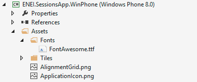
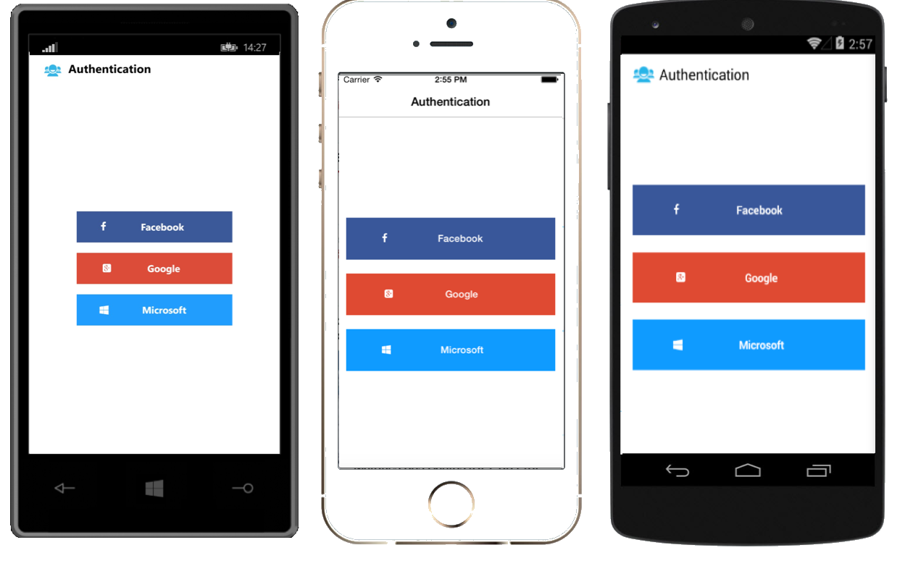

<MTMarkdownOptions output='html4'>
	
</MTMarkdownOptions>

**Table of Contents**

* [1010 ENEI || Xamarin Workshop](#1010-enei--xamarin-workshop) 
* [Scope](#scope)
* [Abstract](#abstract)
* [Requirements](#requirements)
* [Guides](#guides)
	1. [Creating a Xamarin Forms project](#1--creating-a-xamarin-forms-project)
	    * [Using Xamarin Studio in Mac](#using-xamarin-studio-in-mac)
		* [Using Xamarin Studio in Windows](#using-xamarin-studio-in-windows)
		* [Using Visual Studio in Windows](#using-visual-studio-in-windows)
		* [Running the application](#running-the-application)
		* [Additional notes - Xamarin Forms initialization ](#additional-notes---xamarin-forms-initialization)
	2. [Creating the model and data source](#2-creating-the-model-and-data-source)
	3. [Creating the SessionsView](#3-creating-the-sessionsview)
		* [Creating the Xaml page](#creating-the-xaml-page)
		* [Creating the Header](#creating-the-header)
			* [Defining the Images for each platform](#defining-the-images-for-each-platform)
		* [Creating the Listview](#creating-the-listview)
		* [Creating the ItemTemplate](#creating-the-itemtemplate)
		* [Creating the menu for each Session](#creating-the-menu-for-each-session)
			* [Running the application](#running-the-application-1)
	4. [Creating the SessionDetailsView](#4-creating-the-sessiondetailsview)
		* [Details Gesture](#the-details-gesture)
		* [Running the application](#running-the-application-2)
	5. [Adding ShareService](#5-adding-shareservice)
	    * [Windows Phone](#windows-phone)
		* [Android](#android)
		* [iOS](#ios)
	6. [Adding splash screen, name and version](#6-adding-splash-screen-name-and-version)
	7. [Adding support for WinRT Apps](#7-adding-support-for-winrt-apps)
	8. [Changing the App.cs to App.xaml](#8-changing-the-appcs-to-appxaml)
	9. [Using MVVM pattern](#9-using-mvvm-pattern)
    10. [Moving ItemTemplate to Resources](#10-moving-itemtemplate-to-resources)
	11. [Creating a LoginView](#11-creating-a-loginview)
		* [Creating the UI using Font Awesome](#creating-the-ui-using-font-awesome)
		* [Creating the LoginViewModel](#creating-the-loginviewmodel)
		* [Handling Navigation](#handling-navigation)
		
* [Wrapping Up](#wrapping-up)

## Scope

This **Xamarin Workshop** was created for the [**The Portuguese National Meeting of IT Students (ENEI)**](http://enei.pt/) by [Sara Silva](https://twitter.com/saramgsilva) in which its original content is available [here](https://github.com/saramgsilva/XamarinWorkshop). With the goal to extend it to the global community, [Sara Silva](https://twitter.com/saramgsilva) and [Allan Pead](https://twitter.com/adpead) are creating this repository to create a Xamarin Community Workshop to use in user groups events or by developers to learn Xamarin.

## Abstract

In this **Xamarin Workshop**, you will learn how to create a Xamarin Forms app, in which the main goals are:

- To create a Sessions App from the scratch using XAML;
- To apply the Abstraction pattern;
- To apply the MVVM pattern;
- To use resources and converters
- To use Font Awesome

## Requirements

* Have a Windows or a Mac device;
* Install [Xamarin Studio](http://xamarin.com/download);
* Install [Xamarin IOS](http://developer.xamarin.com/guides/ios/getting_started/installation/) and/or [Xamarin Android](http://developer.xamarin.com/guides/android/getting_started/installation/)
* Install [Xamarin Android Player](https://xamarin.com/android-player) or [Genymotion](https://www.genymotion.com/#!/)
* Install [Visual Studio Community 2013](https://www.visualstudio.com/en-us/news/vs2013-community-vs.aspx)
* Install [Windows Phone 8.1 SDK and Windows SDK for Windows 8.1](https://dev.windows.com/en-us/develop/downloads)

**Notes:**  

1. If you have a Windows device you can create Windows and Android applications. To create iOS applications a Mac is always required, and in this case you can create iOS and Android application using Xamarin Studio. With a Mac and Windows running in Parallels or VMware it is possible to create the three targets at the same time (but a Windows Phone device is required for the deployment!).
2. Xamarin Plugin for Visual Studio is only available on Business plan and for developers that participate in Open Source projects.
3. Each student may acquire their own Xamarin Student License for free in [xamarin.com/student](https://xamarin.com/student).

 
## Guides

### 1.	Creating a Xamarin Forms project 

The application that will be created is a Xamarin Forms application, based on Portable Class Library project. 

#### Using Xamarin Studio in Mac

Start by opening the Xamarin Studio as described in figure 1

**Figure 1: Xamarin Studio in a Mac**

Then create a new Blank App (Xamarin Forms Portable), as following:

**Figure 2: Creating a Blank App (Xamarin Forms Portable)**

In which the result will be something as described in Figure 3:

**Figure 3:  The ENEI.SessionsApp solution**

The ENEI.SessionApp solution is defined by three projects:

* **ENEI.SessionsApp:** portable class library project, which will contain the shared code between targets. This project is regardless of the platform;
* **ENEI.SessionsApp.Droid:** Xamarin Android project, which defines the Android application and knows the Android API;
* **ENEI.SessionsApp.iOS:** Xamarin iOS project, which defines the iOS application and knows the iOS API;

Now, you should update the [NuGet Packages](https://www.nuget.org/) available in project. In the case described in figure 4, you only need to update the [Xamarin Forms NuGet Package](https://www.nuget.org/packages/Xamarin.Forms):

**Figure 4: Xamarin Forms Nuget package to update in iOS application**

To update this package you only need to open the context menu, do a right click to open the context menu and then click “Update”, as described in Figure 5:

**Figure 5: Updating NuGet packages**

The result will be

**Figure 6: iOS project updated**

You need to do the same in the others projects, if needed.
Before running the application, you should select the solution and define the configurations, as following:

**Figure 7: Configuration Properties**

Wowwww, now you are ready to create your 1010 ENEI Session app! 

#### Using Xamarin Studio in Windows

Start by opening the Xamarin Studio as described in figure 8:

**Figure 8: Xamarin Studio in Windows**

Then create a new Blank App (Xamarin Forms Portable), as described in the following figure:

**Figure 9: Creating a Blank App (Xamarin Forms Portable)**

The result will be something as described in figure 10:

**Figure 10:  The ENEI.SessionsApp solution**

The ENEI.SessionApp solution is defined by two projects:

* **ENEI.SessionsApp:** portable class library project, which will contain the shared code between targets. This projects is regardless of the platform;
* **ENEI.SessionsApp.Droid:** Xamarin Android project, which defines the Android application and recognize the Android API;

Now, you should update the [NuGet Packages](https://www.nuget.org/) available in the project. In the case described in figure 11, you only need to update the [Xamarin Forms NuGet Package](https://www.nuget.org/packages/Xamarin.Forms) and the [Xamarin.Android.Support.v4 NuGet Package](https://www.nuget.org/packages/Xamarin.Android.Support.v4/):

**Figure 11: Nuget packages to update in Android application**

To update this package you only need to open the context menu, doing a right click with the mouse and then click “Update”, as described in figure 12:

**Figure 12: Updating Nuget packages**

The result will be

**Figure 13: Android project updated**

You need to do the same in the other project, if needed.
Wowwww, now you are ready to create your 1010 ENEI Session app! 

##### Using Visual Studio in Windows

Start by opening the Visual Studio as described in figure 14
 

**Figure 14: Visual Studio 2013**

And then create a new Blank App (Xamarin Forms Portable), as following:

**Figure 15: Creating a Blank App (Xamarin Forms Portable)**

In which the result will be something as described in figure 16:

**Figure 16:  The ENEI.SessionsApp solution**

The ENEI.SessionApp solution is defined by four projects:

* **ENEI.SessionsApp:** portable class library project, which will contain the shared code between targets. This project is regardless of the platform;
* **ENEI.SessionsApp.Droid:** Xamarin Android project, which defines the Android application and recognize the Android API;
* **ENEI.SessionsApp.iOS:** Xamarin iOS project, which defines the iOS application and recognize the iOS API;
* **ENEI.SessionsApp.WinPhone:** Windows Phone project, which defines the Windows Phone application and recognize the Windows Phone API;

Now, you should update the [Nuget Packages](https://www.nuget.org/) available in the project. This case you only need to update the [Xamarin Forms Nuget Package](https://www.nuget.org/packages/Xamarin.Forms), as described in figure 17 and figure 18:

**Figure 17: Opening the “Manage NuGet Package” window**

**Figure 18: Nuget Package Manager**

The result will be

**Figure 19: Xamarin Forms NuGet package updated**

You need to do the same in the others project, if needed.

Before running the application, you should select the solution and define the build and deploy apps, as following:

**Figure 20: Configuration Properties**

Wowwww you ready to create your 1010 ENEI app! 

#### Running the application

Depending on the scenario you are, you will have more numbers or less numbers platforms covered, here is an overview:

* **Using Xamarin Studio in a Mac:** Android + iOS Apps
* **Using Xamarin Studio in Windows:** Android Apps
* **Using Visual Studio without Xamarin plugin:**  Windows Apps
* **Using Visual Studio with Xamarin plugin:** Windows, Android and iOS (*) apps.

(*) Is required to a Xamarin Build Host in a Mac connect to Visual Studio.

In figure 21, it is possible to see the Android, iOS and the Windows Phone applications running at the same time. The Android app is running in Xamarin Android Player; the iOS app is running in IPhone Simulator and the Windows Phone application is running on a Lumia 1020 device (which is connected to a Windows running in a Parallels, in a Mac).

**Figure 21: Android, iOS and Windows Phone applications running at same time**

#### Additional notes - Xamarin Forms initialization 

Each developer should understand how Xamarin Forms app is defined. This way, developers should know:
In ENEI.SessionsApp.iOS app, more specifically  in AppDelegate.cs has the following code:

     public override bool FinishedLaunching(UIApplication app, NSDictionary options)
     {
            global::Xamarin.Forms.Forms.Init();
            LoadApplication(new App());

            return base.FinishedLaunching(app, options);
    }

Which initializes the Xamarin Forms and defines which class has the starting point for the Xamarin Forms App that defines the main page created with the Xamarin Forms API.
The same happens in ENEI.Sessions.Android app, more specifically in MainActivity.cs:

    protected override void OnCreate(Bundle bundle)
    {
            base.OnCreate(bundle);

            global::Xamarin.Forms.Forms.Init(this, bundle);
            LoadApplication(new App());
    }

And in ENEI.Sessions.WinPhone app, more specifically in MainPage.xaml.cs

      public MainPage()
      {
            InitializeComponent();
            SupportedOrientations = SupportedPageOrientation.PortraitOrLandscape;

            global::Xamarin.Forms.Forms.Init();
            LoadApplication(new ENEI.SessionsApp.App());
     }

At this moment, the App.cs defined in ENEI.SessionsApp (portable class library) is defined by

    public class App : Application
    {
        public App()
        {
            // The root page of your application
            MainPage = new ContentPage
            {
                Content = new StackLayout
                {
                    VerticalOptions = LayoutOptions.Center,
                    Children = {
						new Label {
							XAlign = TextAlignment.Center,
							Text = "Welcome to Xamarin Forms!"
						}
					}
                }
            };
        }
     …

As mentioned early, the ENEI.SessionsApp will be the project, which will have the shared code between targets and it is regardless of the platform. This way, in this project you will define the Model, the Views, the data source and another useful class that can be reused between platforms.

### 2. Creating the model and the data source

#### The model

Before creating the UI, you need to define the model, for it you will define:

* **Session:** the class that defines a session from 1010 ENEI event
* **Speaker:** the class that defines a speaker

Each session should have a speaker (In real scenarios it can have more than one!). Figure 22 defines the class diagram from the model:

**Figure 22: The model**

In ENEI.SessionsApp project create the Session and the Speaker classes in a “Model” folder, as described in figures 23 and 24:

**Figure 23: Creating new Folder**

**Figure 24: Adding new file**

The Session class can be defined by:

    public class Session : INotifyPropertyChanged
    {
        private int _numLikes;
        private Speaker _speaker;
        private string _date;
        private string _description;
        private string _name;
        private bool _isFavorite;
        private string _schedule;
        private string _room;

        public string Name
        {
            get { return _name; }
            set { _name = value; OnPropertyChanged(); }
        }

        public string Description
        {
            get { return _description; }
            set { _description = value; OnPropertyChanged(); }
        }

        public string Date
        {
            get { return _date; }
            set { _date = value; OnPropertyChanged(); }
        }

        public int NumLikes
        {
            get { return _numLikes; }
            set { _numLikes = value; OnPropertyChanged();}
        }

        public Speaker Speaker
        {
            get { return _speaker; }
            set { _speaker = value; OnPropertyChanged(); }
        }

        public bool IsFavorite
        {
            get { return _isFavorite; }
            set { _isFavorite = value; OnPropertyChanged();}
        }

        public string Schedule
        {
            get { return _schedule; }
            set { _schedule = value; OnPropertyChanged(); }
        }

        public string Room
        {
            get { return _room; }
            set { _room = value; OnPropertyChanged(); }
        }

        public string Details
        {
            get { return string.Format("{0} | {1} | Sala {2} ", Date, Schedule, Room); }
        }

        public event PropertyChangedEventHandler PropertyChanged;
        
        protected virtual void OnPropertyChanged([CallerMemberName] string propertyName = null)
        {
            var handler = PropertyChanged;
            if (handler != null) handler(this, new PropertyChangedEventArgs(propertyName));
        }
    }

And the Speaker class can be defined by:
         

    public class Speaker : INotifyPropertyChanged
    {
        private string _name;
        private string _imageUrl;

        public string Name
        {
            get { return _name; }
            set { _name = value; OnPropertyChanged();}
        }

        public string ImageUrl
        {
            get { return _imageUrl; }
            set { _imageUrl = value; OnPropertyChanged(); }
        }

        public event PropertyChangedEventHandler PropertyChanged;

        protected virtual void OnPropertyChanged([CallerMemberName] string propertyName = null)
        {
            var handler = PropertyChanged;
            if (handler != null) handler(this, new PropertyChangedEventArgs(propertyName));
        }
    }

> Both classes implements the interface **INotifyPropertyChangedv**, which allow notify the UI about changes in model and this way the data will be updated in the UI (when is used the bindings).

#### The data source

The data source will define the data that will be loaded by the application, at this moment you will have hard code data, but in real scenarios you should have a file, database or services to provide it.

Get the **SessionsDataSource class** [here](https://github.com/saramgsilva/XamarinWorkshop/blob/master/1010ENEI/2.%20Create%20the%20model%20and%20data%20source/ENEI.SessionsApp/ENEI.SessionsApp/Data/SessionsDataSource.cs), or create your own data.

### 3. Creating the SessionsView

In this step, you will create the user interface for the SessionsView (which is the main page), to show the data defined in the last step.

#### Creating the Xaml page

In Xamarin Studio, select the ENEI.SessionsApp project and create a folder called “Views”, as described in figure 25 and figure 26:

**Figure 25: Creating new folder**

**Figure 26: The Views folder in the project**

Then select the folder “Views” , double click with the mouse to open the context and then click in “Add”> “New File...” as described in figure 27:

**Figure 27: Add new file**

Select “Forms ContentPage Xaml”, as following:

**Figure 28: Adding a Xaml page**

The result will be something as following:

**Figure 29: The xaml page code**

The SessionsView xaml is defined by:

* The **xaml** file which defines the user interface 
* The **cs** file which defines the code behind 

> This approach is really useful when designers and developers works together, and using MVVM pattern allows to have the UI separated from the behavior of the page.

> See more about Xaml in this article [Xamarin.Forms Xaml Basics](http://developer.xamarin.com/guides/cross-platform/xamarin-forms/xaml-for-xamarin-forms/). 

Now let’s change the App.cs in ENEI.SessionsApp project, to use the SessionsView:

    public class App : Application
    {
        public App()
        {
            // The root page of your application
            MainPage = new NavigationPage(new SessionsView())
            {
                BarBackgroundColor = Color.White,
                BarTextColor = Color.Black
            };
        }

In this case, you defined the MainPage with a NavigationPage in which the content is defined by SessionView. The NavigationPage is required when the application has navigation between pages, and the application should have only one NavigationPage.
At this moment, if you run the application you will not have any content and you should have something like as described in figure 30:

**Figure 30: The xaml page code**

Now let’s define the UI…

#### Creating the Header

The first thing you should define is the Title and the Icon used in the header of the page, something like as following:

**Figure 31: The header**

Which the code can be:

     <ContentPage xmlns="http://xamarin.com/schemas/2014/forms"
             xmlns:x="http://schemas.microsoft.com/winfx/2009/xaml"
             x:Class="ENEI.SessionsApp.Views.SessionsView"
             Title="1010 ENEI || Sessões"
             BackgroundColor="White"
             Icon="ic_action_users.png">

This will be showed in Android and in iOS, but for Windows Phone 8.0 we need to create a workaround for it, as we will see below.

> In Android, more specifically in the MainActivity is required (in this case) to set the Icon in ActionBar as following: ActionBar.SetIcon(Resource.Drawable.ic_action_users); 

The **SessionsView** is a **ContentPage** which is a simple page provided by [Xamarin Forms API](http://api.xamarin.com/?link=N%3aXamarin.Forms) (see more in [Xamarin Forms Gallery](http://developer.xamarin.com/guides/cross-platform/xamarin-forms/controls/pages/)). To define its content, you should use [controls layouts](http://developer.xamarin.com/guides/cross-platform/xamarin-forms/controls/layouts/) like StackLayout or Grid, for example.

**Figure 32: Control Layouts**

This way, let’s choose the Grid as control layout to define two rows and one column, where:

* The first row has the header for Windows Phone (hidden for the others platforms)
* The second row has the ListView to show the sessions. 

The code for it will be something like as following:

        <?xml version="1.0" encoding="utf-8" ?>
        <ContentPage xmlns="http://xamarin.com/schemas/2014/forms"
             xmlns:x="http://schemas.microsoft.com/winfx/2009/xaml"
             x:Class="ENEI.SessionsApp.Views.SessionsView"
             Title="1010 ENEI || Sessões"
             BackgroundColor="White"
             Icon="ic_action_users.png">
           <Grid BackgroundColor="White">
             <Grid.RowDefinitions>
               <RowDefinition Height="Auto" />
               <RowDefinition Height="*" />
             </Grid.RowDefinitions>
           <!-- Title - Only for WP-->
           <StackLayout Grid.Row="0" Orientation="Horizontal" Padding="20,10,0,0">
           <StackLayout.IsVisible>
              <OnPlatform Android="false"
                    WinPhone="true"
                    iOS="false"
                    x:TypeArguments="x:Boolean" />
           </StackLayout.IsVisible>
           <Image WidthRequest="48" 
             HeightRequest="38" 
             Source="Images/ic_action_users.png"/>
           <Label FontSize="Large" FontAttributes="Bold"
                  TextColor="Black">
           <OnPlatform Android=""
                    WinPhone="1010 ENEI || Sessões"
                    iOS=""
                    x:TypeArguments="x:String" />
            </Label>
           </StackLayout>
           <!-- ListView will be defined here -->
          </Grid>
        </ContentPage>

##### Defining the Images for each platform

In the last step you used the image “ic_action_users.png” which need to be added to each project (ENEI.SessionApp.Android, ENEI.SessionApp.iOS and ENEI.SessionApp.WinPhone). This way, each app will have its own images, which should be defined following the platform specifications, i.e., each image should provide the right resolution by platform.

Get the images & assets by platform [here](https://github.com/saramgsilva/XamarinWorkshop/tree/master/1010ENEI/0.%20Assests%20and%20Images), and see more about this subject in this [article](http://developer.xamarin.com/guides/cross-platform/xamarin-forms/working-with/images/).

At this moment, you should have the following result:

 
**Figure 33: The Windows Phone, iOS and Android applications**

#### Creating the Listview

The next step is to define the list of the session from the 1010 ENEI, in which were defined in the topic “The Data Source”. 
To show the list of the sessions you will use a ListView which must have:

* The **ItemsSource** which defines the list of sessions
* The **ItemTemplate** which defines the template for each row

Let’s define the first version of the ListView as following:

    <!-- ListView will be defined here -->
    <ListView x:Name="SessionsList"
                 Grid.Row="1"
                 ItemSelected="SessionsList_OnItemSelected"
                 ItemsSource="{Binding Sessions}"
                 SeparatorColor="#0094FF">
      <!--
                Setting the HasUnevenRows property tells the list view to render
                each cell with a different height.
            -->
      <ListView.RowHeight>
        <OnPlatform Android="150"
                    WinPhone="180"
                    iOS="150"
                    x:TypeArguments="x:Int32" />
      </ListView.RowHeight>
    </ListView>
  

The Listview has the name “SessionsList”, which is defined in the second row of the grid that defines the root content of the page, it has the “ItemSelected” subscribed to ignore the “SelectItem”, the “SeparatorColor" is defined as blue and the “ItemsSource” is binding with the “Sessions” property (which is a property from the object defined in “BindingContext”).

> Data bindings allows properties of two objects to be linked so that a change in one causes a change in the other. See more about it in these article [Data Binding Basics](http://developer.xamarin.com/guides/cross-platform/xamarin-forms/xaml-for-xamarin-forms/data_binding_basics/) and [From Data Bindings to MVVM](http://developer.xamarin.com/guides/cross-platform/xamarin-forms/xaml-for-xamarin-forms/data_bindings_to_MVVM/).

Each row from the ListView can be defined with static or dynamic size. In this case it was defined a static size for each platform (related with screen resolution). A developer that needs to have different row size depending the data showed is recommended to use the property HasUnevenRows.

To complete, in code behind, you need to define the Sessions that should be an “ObservableCollection” of Session (this kind of list allows to notify the UI each time an object is removed or added in the list).  You need to get the sessions from the “SessionsDataSource” and you need to define the “BindingContext”. The data should be loaded in the “OnAppearing” method and is not recommended to load it in the constructor of the page, because it will increase the time required to create the page which can create issues.

    public partial class SessionsView : ContentPage
    {
        public SessionsView()
        {
            InitializeComponent();
            Sessions = new ObservableCollection<Session>();
            BindingContext = this;

        }

        public ObservableCollection<Session> Sessions { get; set; }

        protected override void OnAppearing()
        {
            base.OnAppearing();
            if (Sessions.Count == 0)
            {
                var sessions = SessionsDataSource.GetSessions();
                foreach (var session in sessions)
                {
                    Sessions.Add(session);
                }
            }
        }
        private void SessionsList_OnItemSelected(object sender, SelectedItemChangedEventArgs e)
        {
            if (SessionsList.SelectedItem == null)
            {
                return;
            }

            SessionsList.SelectedItem = null;
        }
    }

 
> In this case, you will not use MVVM pattern, which is extremely recommended in real projects. To keep it simple, the code behind will have the behavior used by the UI, in which the code is defined in the ViewModel when an application implements the MVVM pattern.

#### Creating the ItemTemplate

The Listview has the “ItemTemplate” property that allows to define a “DataTemplate” for each row. In this case you will define a template as described in figure 34, which the code will be:

     <ListView.ItemTemplate>
         <DataTemplate>
                    <ViewCell>
                        <ViewCell.View>
                            <Grid BackgroundColor="Transparent" Padding="20,0,20,0">
                                <Grid.ColumnDefinitions>
                                    <ColumnDefinition Width="Auto" />
                                    <ColumnDefinition Width="*" />
                                </Grid.ColumnDefinitions>
                                <Grid.RowDefinitions>
                                    <RowDefinition Height="5" />
                                    <RowDefinition Height="Auto" />
                                    <RowDefinition Height="48" />
                                    <RowDefinition Height="5" />
                                </Grid.RowDefinitions>
                                <!-- Define the Image from Speaker -->
                                <Image Grid.Row="1"
                                       HorizontalOptions="StartAndExpand"
                                       Source="{Binding Speaker.ImageUrl}"
                                       VerticalOptions="Start">
                                    <Image.WidthRequest>
                                        <OnPlatform Android="50"
                                                    WinPhone="100"  iOS="50"
                                                    x:TypeArguments="x:Double" />
                                    </Image.WidthRequest>
                                    <Image.HeightRequest>
                                        <OnPlatform Android="50"
                                                    WinPhone="100" iOS="50"
                                                    x:TypeArguments="x:Double" />
                                    </Image.HeightRequest>
                                </Image>
                                <!-- Define the Image from Speaker -->
                                <StackLayout Grid.Row="1"
                                             Grid.Column="1"
                                             HorizontalOptions="FillAndExpand"
                                             Padding="10,0,0,0">
                                    <Label Font="Medium"
                                           FontAttributes="Bold"
                                           Text="{Binding Name}"
                                           TextColor="Black" />
                                    <Label Font="Medium"
                                           LineBreakMode="TailTruncation"
                                           Text="{Binding Speaker.Name}"
                                           TextColor="Black" />
                                    <Label Font="Small"
                                           LineBreakMode="TailTruncation"
                                           TextColor="Black" Text="{Binding Details}"/>
                                </StackLayout>               
                                <!-- Define the menu for each session -->  
                           </Grid>
                       </ViewCell.View>
                    </ViewCell>
                </DataTemplate>
      </ListView.ItemTemplate>

**Figure 34: A row in listview**

Running the application you will have the following:

**Figure 35: The Windows Phone, iOS and Android application showing sessions from 1010 ENEI**

#### Creating the menu for each Session

To create the menu for each session as described in figure 36, you need to change the ItemTemplate defined above:

**Figure 36: The session’s menu**

The implementation can be something as following:

    <Grid Grid.Row="2" Grid.Column="0"  Grid.ColumnSpan="2" Padding="0,5,0,0">
                  <Grid.ColumnDefinitions>
                    <ColumnDefinition Width="*" /> <ColumnDefinition Width="Auto" />
                    <ColumnDefinition Width="*" /> <ColumnDefinition Width="Auto" /><ColumnDefinition Width="*" />
                    <ColumnDefinition Width="Auto" /> <ColumnDefinition Width="*" /><ColumnDefinition Width="Auto" />
                    <ColumnDefinition Width="*" />
                  </Grid.ColumnDefinitions>
                  <StackLayout Grid.Column="1" Orientation="Horizontal">
                    <Image>
                      <Image.WidthRequest>
                        <OnPlatform Android="48" WinPhone="48" iOS="30"  x:TypeArguments="x:Double" />
                      </Image.WidthRequest>
                      <Image.HeightRequest>
                        <OnPlatform Android="48"  WinPhone="48" iOS="30" x:TypeArguments="x:Double" />
                      </Image.HeightRequest>
                      <Image.Source>
                        <OnPlatform x:TypeArguments="ImageSource">
                          <OnPlatform.iOS>  <FileImageSource File="ic_action_like.png" />
                          </OnPlatform.iOS>
                          <OnPlatform.Android> <FileImageSource File="ic_action_like.png" />
                          </OnPlatform.Android>
                          <OnPlatform.WinPhone><FileImageSource File="Images/ic_action_like.png" />
                          </OnPlatform.WinPhone>
                        </OnPlatform>
                      </Image.Source>
                    </Image>
                    <Label Font="Small" Text="{Binding NumLikes}" TextColor="#0094FF" VerticalOptions="Center" />
                  </StackLayout>
                  <Image Grid.Column="3" Source="{Binding IsFavorite, Converter={StaticResource FavoriteImageConverter}}">
                    <Image.WidthRequest>
                      <OnPlatform Android="48" WinPhone="48" iOS="30"  x:TypeArguments="x:Double" />
                    </Image.WidthRequest>
                    <Image.HeightRequest>
                      <OnPlatform Android="48"  WinPhone="48"    iOS="30"  x:TypeArguments="x:Double" />
                    </Image.HeightRequest>
                  </Image>
                  <Image Grid.Column="5">
                    <Image.WidthRequest>
                      <OnPlatform Android="30"  WinPhone="48" iOS="30" x:TypeArguments="x:Double" />
                    </Image.WidthRequest>
                    <Image.HeightRequest>
                      <OnPlatform Android="30"  WinPhone="48" iOS="30" x:TypeArguments="x:Double" />
                    </Image.HeightRequest>
                    <Image.Source>
                      <OnPlatform x:TypeArguments="ImageSource">
                        <OnPlatform.iOS><FileImageSource File="ic_action_share_2.png" /></OnPlatform.iOS>
                        <OnPlatform.Android><FileImageSource File="ic_action_share_2.png" /></OnPlatform.Android>
                        <OnPlatform.WinPhone>
      <FileImageSource File="Images/ic_action_share_2.png" /></OnPlatform.WinPhone>
                      </OnPlatform> </Image.Source>  </Image>
                  <Image Grid.Column="7">
                    <Image.WidthRequest>
                      <OnPlatform Android="30" WinPhone="48" iOS="30"   x:TypeArguments="x:Double" />
                    </Image.WidthRequest>
                    <Image.HeightRequest>
                      <OnPlatform Android="30"   WinPhone="48"  iOS="30" x:TypeArguments="x:Double" />
                    </Image.HeightRequest>
                    <Image.Source>
                      <OnPlatform x:TypeArguments="ImageSource">
                        <OnPlatform.iOS>   <FileImageSource File="ic_action_list.png" />
                        </OnPlatform.iOS>
                        <OnPlatform.Android><FileImageSource File="ic_action_list.png" />
                        </OnPlatform.Android>
                        <OnPlatform.WinPhone> <FileImageSource File="Images/ic_action_list.png" />
                        </OnPlatform.WinPhone>
                      </OnPlatform>
                    </Image.Source>
                  </Image>
                </Grid>
         

> The SessionDetailsView will have a similar implementation for the header as defined in the SessionsView, the difference it is in the title value, which will be defined by the Session’s name.

The code above contains a grid with four images: Like, Favorite, Share and Details. And for each one we need to subscribe the Tap event using the “GestureRecognizers” from the Image, this way you need to define for each image its TapGesture as following:

     <Image.GestureRecognizers>
     <TapGestureRecognizer x:Name="FavoriteGesture"
                 CommandParameter="{Binding}" Tapped="FavoriteGestureRecognizer_OnTapped" />
    </Image.GestureRecognizers>

Where the event’s handler will be defined as following:

      private void FavoriteGestureRecognizer_OnTapped(object sender, EventArgs e)
        {
            var tappedEventArg = e as TappedEventArgs;
            if (tappedEventArg != null)
            {
                var session = tappedEventArg.Parameter as Session;
                if (session != null)
                {
                    session.IsFavorite = !session.IsFavorite;
                }
            }
        }

> Do the same for "Like", for Share and Details we will see it in the next steps

For the Favorite option use a FavoriteImageConverter which allows to show the right image based on if the user selected it as a favorite or not, this way if the favorite option is red it means the user selected the session as favorite, the blue color is defined by default.

The implementation of the FavoriteImageConverter will be something as following:

    public class FavoriteImageConverter:IValueConverter
    {
        public object Convert(object value, Type targetType, object parameter, CultureInfo culture)
        {
            if (value == null)
            {
                return Device.OS == TargetPlatform.WinPhone ? "Images/ic_action_heart.png" : "ic_action_heart.png";
            }
            var isFavorite = (bool) value;

            if (isFavorite)
            {
                return Device.OS == TargetPlatform.WinPhone ? "Images/ic_action_heart_red.png" : "ic_action_heart_red.png";
            }
            return Device.OS == TargetPlatform.WinPhone ? "Images/ic_action_heart.png" : "ic_action_heart.png";
        }

        public object ConvertBack(object value, Type targetType, object parameter, CultureInfo culture)
        {
            throw new NotImplementedException();
        }
    }

##### Running the application

At this moment you should have the UI from the 1010 ENEI Sessions App as described in figure 37:

**Figure 37: The Windows Phone, iOS and Android applications**

### 4. Creating the SessionDetailsView

In the last step, you created the menu for each Session and it was created the “Details” option, which is intended to show the details from a selected session. 

Let’s create the SessionDetailsView!

Create a new Xaml page, just like you did to create the SessionsView page. Then open the SessionDetailsView and you should have something as following:

Then create the content, as following:

    <?xml version="1.0" encoding="utf-8" ?>
    <ContentPage x:Class="ENEI.SessionsApp.View.SessionDetailsView"
             xmlns="http://xamarin.com/schemas/2014/forms"
             xmlns:x="http://schemas.microsoft.com/winfx/2009/xaml"
             BackgroundColor="White"    Icon="ic_action_users.png">
    <StackLayout BackgroundColor="White" Spacing="20">
      <StackLayout Orientation="Horizontal" Padding="20,10,0,0">
        <StackLayout.IsVisible>
          <OnPlatform Android="false"
                      WinPhone="true" iOS="false”   x:TypeArguments="x:Boolean" />
        </StackLayout.IsVisible>
        <Image WidthRequest="48" HeightRequest="38" Source="Images/ic_action_users.png"/>
        <Label FontSize="Large" FontAttributes="Bold" Text="{Binding Name}"
             TextColor="Black"/>
      </StackLayout>
      <StackLayout Orientation="Horizontal" Padding="20,20,20,0" Spacing="20">
            <Image HorizontalOptions="Start"
                   Source="{Binding Speaker.ImageUrl}"
                   VerticalOptions="Start">
                <Image.WidthRequest>
                    <OnPlatform Android="50" WinPhone="200" iOS="50"
                                x:TypeArguments="x:Double" />
                </Image.WidthRequest>
                <Image.HeightRequest>
                    <OnPlatform Android="50" WinPhone="200"    iOS="50"
                                x:TypeArguments="x:Double" />
                </Image.HeightRequest>
            </Image>
            <StackLayout HorizontalOptions="Start" Padding="10,0,0,0">
                <Label Font="Large"
                       HorizontalOptions="Start"
                       LineBreakMode="WordWrap"
                       Text="{Binding Speaker.Name}"
                       TextColor="Black" />
                <Label Font="Small"
                       HorizontalOptions="Start"
                       LineBreakMode="TailTruncation"
                       Text="{Binding Date}"
                       TextColor="Black" />
            </StackLayout>
        </StackLayout>

      <ScrollView VerticalOptions="FillAndExpand"  Padding="20,20,20,0">
            <Label Font="Medium"
                   HorizontalOptions="Start"
                   LineBreakMode="WordWrap"
                   Text="{Binding Description}"
                   TextColor="Black" />
        </ScrollView>
    </StackLayout>
    </ContentPage>

And in code behind define the BindingContext and the Title, as following: 

    public partial class SessionDetailsView : ContentPage
    {
        private readonly Session _session;

        public SessionDetailsView(Session session)
        {
            _session = session;
            InitializeComponent();
            Title = session.Name;
            BindingContext = session;
        }
    }

This page will have the BindingContext defined with session object, but it could be the page as in SessionsView.

#### The Details gesture

Now that you have the new page created, you need to connect both pages and it is possible to do so through the “Detail” option for each session in the Listview. This way, in the SessionsView we need to use the details gesture to navigate from the SessionsView to the SessionDetailsView, sending the selected session. The implementation can be something as following:

       private void DetailsGesture_OnTapped(object sender, EventArgs e)
        {
            var tappedEventArg = e as TappedEventArgs;
            if (tappedEventArg != null)
            {
                var session = tappedEventArg.Parameter as Session;
                if (session != null)
                {
                    Navigation.PushAsync(new SessionDetailsView(session), true);
                }
            }
        }

#### Running the application

At this moment, you should navigate to the Session details view, which the result should be as described in figure 38:

**Figure 38: The Windows Phone, iOS and Android applications**

> The navigation from the SessionDetailsView is made using the back button provided on iOS and Android pages and by physical back button from Windows Phone, which do not require implementation.

### 5. Adding ShareService

An application which allows to share the content in social networks brings more value to the users, because it allows to share with others something the user think is important or relevant. An application for events like 1010 ENEI Sessions App could not miss this feature.

Each platform has its own implementation to share content in social network. This means, we need to create an abstraction of the share feature to use it in ENEI.SessionsApp and then in each platform we need to implement that abstraction.
Let’s see how the Abstraction Pattern can be created!

In ENEI.SessionsApp project, create the interface IShareService as following:

    public interface IShareService
    {
        void ShareLink(string title, string status, string link);
    }
  

Then it is required to create the implementation of the IShareService in each platform. Let’s define the following implementation by platform:

#### Windows Phone

	[assembly: Dependency(typeof(ShareService))]
    namespace ENEI.SessionsApp.WinPhone.Services
    {
        public class ShareService : IShareService
        {
          public void ShareLink(string title, string status, string link)
          {
            var task = new ShareLinkTask { Title = title, Message = status, LinkUri = new Uri(link) };
            Device.BeginInvokeOnMainThread(() =>
            {
                try
                {
                    task.Show();
                }
                catch (Exception ex)
                {
                 // todo handle the error   
                }
            });
        }
      }
    }

#### Android

     

     [assembly: Dependency(typeof(ShareService))]
     namespace ENEI.SessionsApp.Droid.Services
     {
       public class ShareService : IShareService
       {
         public void ShareLink(string title, string status, string link)
         {
            var intent = new Intent(global::Android.Content.Intent.ActionSend);
            intent.PutExtra(global::Android.Content.Intent.ExtraText, string.Format("{0} - {1}", status ?? string.Empty, link ?? string.Empty));
            intent.PutExtra(global::Android.Content.Intent.ExtraSubject, title ?? string.Empty);
            intent.SetType("text/plain");
            intent.SetFlags(ActivityFlags.ClearTop);
            intent.SetFlags(ActivityFlags.NewTask);
            Android.App.Application.Context.StartActivity(intent);
        }
      }
    }

#### iOS
	

	[assembly: Dependency(typeof(ShareService))]
    namespace ENEI.SessionsApp.iOS.Services
    {
    public class ShareService : IShareService
    {
        public void ShareLink(string title, string status, string link)
        {
            var actionSheet = new UIActionSheet("Share on");
            foreach (SLServiceKind service in Enum.GetValues(typeof(SLServiceKind)))
            {
                actionSheet.AddButton(service.ToString());
            }
            actionSheet.Clicked += delegate(object a, UIButtonEventArgs b)
            {
                SLServiceKind serviceKind = (SLServiceKind)Enum.Parse(typeof(SLServiceKind), actionSheet.ButtonTitle(b.ButtonIndex));
                ShareOnService(serviceKind, title, status, link);
            };
            actionSheet.ShowInView(UIApplication.SharedApplication.KeyWindow.RootViewController.View);
        }

        private void ShareOnService(SLServiceKind service, string title, string status, string link)
        {
            if (SLComposeViewController.IsAvailable(service))
            {
                var slComposer = SLComposeViewController.FromService(service);
                slComposer.SetInitialText(status);
                slComposer.SetInitialText(title != null ? string.Format("{0} {1}", title, status) : status);
                if (link != null)
                {
                    slComposer.AddUrl(new NSUrl(link));
                }
                slComposer.CompletionHandler += (result) =>
                {
                    UIApplication.SharedApplication.KeyWindow.RootViewController.InvokeOnMainThread(() =>
                    {
                        UIApplication.SharedApplication.KeyWindow.RootViewController.DismissViewController(true, null);
                    });
                };
                UIApplication.SharedApplication.KeyWindow.RootViewController.PresentViewController(slComposer, true, null);
            }
        }
      }
    }

This way, we are ready to call the share service in the SessionsView using DependencyService, as following:

	private void ShareGesture_OnTapped(object sender, EventArgs e)
        {
            var tappedEventArg = e as TappedEventArgs;
            if (tappedEventArg != null)
            {
                var session = tappedEventArg.Parameter as Session;
                if (session != null)
                {
                    var shareService = DependencyService.Get<IShareService>();
                    if (shareService != null)
                    {
                        var status = string.Format("Não percas a sessão {0} de {1}.", session.Name, session.Speaker.Name);
                        shareService.ShareLink("ENEI 2015", status, "https://enei.pt/");
                    }
                }
            }
        }

> The **DependencyService** only will get the implementation from the **IShareService** because the implementation from each platform was registered using:
**[assembly: Dependency(typeof(ShareService))]**

At this moment the 1010 ENEI Sessions App has support to share the session on social network!

### 6. Adding splash screen, name and version

In this step you will learn how to create the splash screen to all platforms and you will learn how to define the name & version of the application.

#### Defining the splash screen

The splash screen in a mobile application is the first screen that the user will see, in some applications it is used to load initial data. It is defined in different ways on each platform and for each one you will learn how it works:

* In **ENEI.SessionsApps.iOS**

On iOS and iPad applications it is possible to define launch images as splash screen in the Info.plist. It is described in the following images:

**Figure 6.1: Defining Launch Images using Visual Studio**

**Figure 6-2: Defining Launch images in Xamarin Studio**

•	In **ENEI.SessionsApps.Android**

By default, on Android applications, there is not the splash screen concept. To solve it, it is possible to create an Activity that will be a splash screen page.

In the **ENEI.SessionsApp** create the **SplashScreen** class, as following:

    [Activity(Label = "1010 ENEI", MainLauncher = true, NoHistory = true, Theme = "@style/Theme.Splash",
     ConfigurationChanges = ConfigChanges.ScreenSize, ScreenOrientation = ScreenOrientation.Portrait)]
    public class SplashScreen : Activity
    {
        protected override void OnCreate(Bundle bundle)
        {
            base.OnCreate(bundle);

            var intent = new Intent(this, typeof(MainActivity));
            StartActivity(intent);
            Finish();
        }
    }

In the **Resources\Values** folder create an xml file called **Style**, as following:
  

     <?xml version="1.0" encoding="utf-8" ?>
       <resources>
            
           
    </resources>

Then change the **MainActivity** to:

    [Activity(Label = "1010 ENEI", Theme = "@style/Theme.ENEI", ConfigurationChanges = ConfigChanges.ScreenSize | ConfigChanges.Orientation)]
  
    public class MainActivity : global::Xamarin.Forms.Platform.Android.FormsApplicationActivity
    {
        protected override void OnCreate(Bundle bundle)
        {
            base.OnCreate(bundle);
            global::Xamarin.Forms.Forms.Init(this, bundle);
            ActionBar.SetIcon(Resource.Drawable.ic_action_users);
            LoadApplication(new App());
        }
    }
 
If you run the Android application you will get the “splash screen” defined, similar to the others platforms.

 > See more about it in this article [Creating a Splash Screen](http://developer.xamarin.com/guides/android/user_interface/creating_a_splash_screen/).

* In **ENEI.SessionsApps.WinPhone**

Windows Phone application supports splash screen by default, this way it only requires a nice image which will be showed to the user.

**Figure 6-3: The SplashScreenImage**

#### Defining the name and the version for each platform

To define the name & the version for each platform you will need:

* In **ENEI.SessionsApps.iOS**

Open the **Info.plist** or the **project’s properties** as described in figure 6-4 and figure 6-5:

**Figure 6-4: Defining Name & Version using Xamarin Studio (Info.plist)**

**Figure 6-5: Defining Name & Version using Visual Studio (project’s properties)**

* In **ENEI.SessionsApp.Android**

Open the project’s properties as described in figure 6-6 and figure 6-7:

**Figure 6-6: Defining Name & Version using Xamarin Studio (project’s properties)**

**Figure 6-7: Defining Name & Version using Visual Studio (project’s properties)**

* In **ENEI.SessionsApps.WinPhone**

Open the manifest file as described in the figure 6-8 and figure 6-9:

**Figure 6-8: Defining Name in the manifest file**

**Figure 6-9: Defining Version in the manifest file**

### 7. Adding support for WinRT Apps

In this step you will learn how to add support to WinRT apps, which means you will create an Universal app that will use [Xamarin Forms for Windows (Preview)](https://www.nuget.org/packages/Xamarin.Forms.Windows/).

To start, create a new project based on a Universal App template, as described in figure 39 and figure 40:

**Figure 39: Creating new project**

**Figure 40: Blank App (Universal App)**

The result will be:

**Figure 41: The solution**

Now, you will add the ENEI.SessionsApp reference to the WinRT project, as described in figure 42 and figure 43:

**Figure 42: Adding Reference**

**Figure 43: Selecting the ENEI.SessionApp**

On the Windows Phone 8.1 (WinRT) app we can get an error as following:

**Figure 44: Error adding ENEI.SessionsApp**

This error means that the ENEI.SessionsApp is a portable class library (PCL) that does not support Windows Phone 8.1 (WinRT). This way, you need to change the PCL project (in Properteis) to support this target, as described in figure 45:

**Figure 45: Add support to Windows Phone 8.1 (WinRT)**

After this, you will have the references added to each project, as following:

**Figure 46: The references**

Before you create the code, you need to install the Xamarin Forms Windows (Preview) NuGet Package as following:

**Figure 47: Opening the “Manage NuGet Packages…”**

**Figure 48: Installing the Xamarin Forms Windows (Preview)**

**Figure 49: The Xamarin Forms Windows (Preview) installed**

Let’s do some code!

In general, you should do not make so many changes to have the WinRT apps. First, you need to start by setting up the Xamarin Forms setup,, this way you need change the OnLaunched method in the App.xaml.cs as following:

      protected override void OnLaunched(LaunchActivatedEventArgs e)
        {
           #if DEBUG
            if (System.Diagnostics.Debugger.IsAttached)
            {
                this.DebugSettings.EnableFrameRateCounter = true;
            }
          #endif

            Frame rootFrame = Window.Current.Content as Frame;

            // Do not repeat app initialization when the Window already has content,
            // just ensure that the window is active
            if (rootFrame == null)
            {
                // Create a Frame to act as the navigation context and navigate to the first page
                rootFrame = new Frame();

                // TODO: change this value to a cache size that is appropriate for your application
                rootFrame.CacheSize = 1;

                global:Xamarin.Forms.Forms.Init(e);

       ….

       

Like in the others platform, the **Init** method will initialize the Xamarin Forms, in this case it is needed to send the LaunchActivatedEventArgs.

And we need to change the MainPage constructor, from each WinRT app, to:

      
       public MainPage()
        {
            this.InitializeComponent();

            this.NavigationCacheMode = NavigationCacheMode.Required;
            LoadApplication(new ENEI.SessionsApp.App());
        }

and the page type must be change to:

* On Windows Phone 8.1 (WinRT):

        <forms:WindowsPhonePage
           x:Class="ENEI.SessionsApp.WinRT.MainPage"
           xmlns="http://schemas.microsoft.com/winfx/2006/xaml/presentation"
           xmlns:x="http://schemas.microsoft.com/winfx/2006/xaml"
           xmlns:forms="using:Xamarin.Forms.Platform.WinRT"
           xmlns:d="http://schemas.microsoft.com/expression/blend/2008"
           xmlns:mc="http://schemas.openxmlformats.org/markup-compatibility/2006"
           mc:Ignorable="d"
           Background="{ThemeResource ApplicationPageBackgroundThemeBrush}">            
  
        </forms:WindowsPhonePage>        

* On Windows 8.1 Store App (WinRT):

        <forms:WindowsPage
            x:Class="ENEI.SessionsApp.WinRT.MainPage"
            xmlns="http://schemas.microsoft.com/winfx/2006/xaml/presentation"
            xmlns:x="http://schemas.microsoft.com/winfx/2006/xaml"
            xmlns:forms="using:Xamarin.Forms.Platform.WinRT"
            xmlns:d="http://schemas.microsoft.com/expression/blend/2008"
            xmlns:mc="http://schemas.openxmlformats.org/markup-compatibility/2006"
            mc:Ignorable="d"
            Foreground="Black"
            Background="White">
        </forms:WindowsPage>

Now, it is needed to define the background color from the NavigationPage to white, which should be defined from the beginning:

            MainPage = new NavigationPage(new SessionsView())
            {  
                BarBackgroundColor = Color.White,
                BarTextColor = Color.Black,
                BackgroundColor = Color.White,
            };

At this moment, you will see the header in the right way but the images from the menu are not displayed, this is because each image was defined by:

                  <Image Grid.Column="7">
                    <Image.WidthRequest>
                      <OnPlatform Android="30"
                                  WinPhone="48"
                                  iOS="30"
                                  x:TypeArguments="x:Double" />
                    </Image.WidthRequest>
                    <Image.HeightRequest>
                      <OnPlatform Android="30"
                                  WinPhone="48"
                                  iOS="30"
                                  x:TypeArguments="x:Double" />
                    </Image.HeightRequest>
                    <Image.Source>
                      <OnPlatform x:TypeArguments="ImageSource">
                        <OnPlatform.iOS>
                          <FileImageSource File="ic_action_list.png" />
                        </OnPlatform.iOS>
                        <OnPlatform.Android>
                          <FileImageSource File="ic_action_list.png" />
                        </OnPlatform.Android>
                        <OnPlatform.WinPhone>
                          <FileImageSource File="Images/ic_action_list.png" />
                        </OnPlatform.WinPhone>
                      </OnPlatform>
                    </Image.Source>
                    <Image.GestureRecognizers>
                      <TapGestureRecognizer x:Name="DetailsGesture"
                                            CommandParameter="{Binding}"
                                            Tapped="DetailsGesture_OnTapped" />
                    </Image.GestureRecognizers>
                  </Image>

Which are using OnPlatform to set the image’s source and the image’s height and width. In the preview version used, it is not possible to use it, but in future it will work on Windows apps like works for the others platforms. 

This way, you need to create a workaround to make sure the images will be loaded and they will use converters, as following:

         <ContentPage.Resources>
            <ResourceDictionary>
              <converters:FavoriteImageConverter x:Key="FavoriteImageConverter" />
              <converters:ImageSizeConverter x:Key="ImageSizeConverter"/>
              <converters:ImageUrlConverter x:Key="ImageUrlConverter"/>
              <converters:RowHeightConverter x:Key="RowHeightConverter"/>
            </ResourceDictionary>
         </ContentPage.Resources>

And 

               <Image Grid.Column="7"
                      Source="{Binding Converter={StaticResource ImageUrlConverter}, ConverterParameter=Details}"
                      HeightRequest="{Binding Converter={StaticResource ImageSizeConverter}}"
                      WidthRequest="{Binding Converter={StaticResource ImageSizeConverter}}">
                    <Image.GestureRecognizers>
                      <TapGestureRecognizer x:Name="DetailsGesture"
                                            CommandParameter="{Binding}"
                                            Tapped="DetailsGesture_OnTapped" />
                    </Image.GestureRecognizers>
                  </Image>

Where the converters are defined by:

> The **ImageSizeConverter** to define the **Height** and the **Width** for the images

    public class ImageSizeConverter:IValueConverter
    {
        public object Convert(object value, Type targetType, object parameter, CultureInfo culture)
        {
            if (value != null)
            {

                if (Device.OS == TargetPlatform.Android || Device.OS == TargetPlatform.Windows)
                {
                    return 48;
                }
                if (Device.OS == TargetPlatform.iOS)
                {
                    return 30;
                }
            }
            return value;
        }

        public object ConvertBack(object value, Type targetType, object parameter, CultureInfo culture)
        {
            throw new NotImplementedException();
        }
    }            
             

> The **ImageUrlConverter**, to define the path for the images:

                   
    public class ImageUrlConverter:IValueConverter
    {
        public object Convert(object value, Type targetType, object parameter, CultureInfo culture)
        {
            if (parameter !=null && !string.IsNullOrEmpty(parameter.ToString()))
            {
                var imageUrl = string.Empty;
                switch (parameter.ToString())
                {
                    case "Like":
                        imageUrl= Device.OS == TargetPlatform.WinPhone || Device.OS == TargetPlatform.Windows ?
                        "Images/ic_action_like.png":
                        "ic_action_like.png";
                        break;
                    case "Share":
                        imageUrl = Device.OS == TargetPlatform.WinPhone || Device.OS == TargetPlatform.Windows ?
                       "Images/ic_action_share_2.png" :
                       "ic_action_share_2.png";
                        break;
                    case "Details":
                        imageUrl = Device.OS == TargetPlatform.WinPhone || Device.OS == TargetPlatform.Windows ?
                       "Images/ic_action_list.png" :
                       "ic_action_list.png";
                        break;
                }

                return ImageSource.FromFile(imageUrl);
            }
            return null;
        }

        public object ConvertBack(object value, Type targetType, object parameter, CultureInfo culture)
        {
            throw new NotImplementedException();
        }
    }

> The **RowHeightConverter** to define the size of the row from the ListView:

    public class RowHeightConverter:IValueConverter
    {
        public object Convert(object value, Type targetType, object parameter, CultureInfo culture)
        {
            if (value != null)
            {

                if (Device.OS == TargetPlatform.Android || Device.OS == TargetPlatform.iOS)
                {
                    return 150;
                }
                if (Device.OS == TargetPlatform.WinPhone)
                {
                    return 180;
                }
                if (Device.OS == TargetPlatform.Windows)
                {
                    return 200;
                }
            }
            return value;
        }

        public object ConvertBack(object value, Type targetType, object parameter, CultureInfo culture)
        {
            throw new NotImplementedException();
        }
    }

At this moment if you run the applications you will have something as following:

**Figure 50: The WinRT apps**

### 8. Changing the App.cs to App.xaml

In this step you will learn how to change the **App.cs** to have the **App.xaml** file, which will define the Xamarin Forms application.

In the **ENEI.SessionsApp** project it is possible to find the App.cs file which defines the application. It is a simple class defined in a *.cs file, which can be defined using a XAML approach. For it you need to create a new XAML page as described in figure 51 and figure 52:

**Figure 51: Adding a new item (using Visual Studio)**

**Figure 52: Adding a new Forms Xaml Page called App (using Visual Studio)**

The result will be something as following:


**App.xaml**

	    <?xml version="1.0" encoding="utf-8" ?>
        <ContentPage xmlns="http://xamarin.com/schemas/2014/forms"
             xmlns:x="http://schemas.microsoft.com/winfx/2009/xaml"
             x:Class="ENEI.SessionsApp.App">
	       <Label Text="{Binding MainText}" VerticalOptions="Center" HorizontalOptions="Center" />
       </ContentPage>

**App.xaml.cs**

     public partial class App : ContentPage
     {
        public App()
        {
            InitializeComponent();
        }
     }

At this moment, this is a content page, which is not our goal, but it is the workaround to create the App.xaml and App.xaml.cs files. Now, to create the Xamarin Forms application based in the XAML approach we need to change the code above, as following:

**App.xaml**

 
      <?xml version="1.0" encoding="utf-8" ?>
      <Application xmlns="http://xamarin.com/schemas/2014/forms"
             xmlns:x="http://schemas.microsoft.com/winfx/2009/xaml"
             x:Class="ENEI.SessionsApp.App">
      </Application>	

 
**App.xaml.cs**


    public partial class App : Application
    {
        public App()
        {
            InitializeComponent();
        }
    }

 
With this, you will have an App class that inherits from Xamarin.Forms.Application, to avoid it, you should delete the App.cs file, but before we need to move the code from the App.cs to the App.xaml.cs, which the result will be something as following:
 
    public class App : Application
    {
        public App()
        {
            // The root page of your application
            MainPage = new NavigationPage(new SessionsView())
            {  
                BarBackgroundColor = Color.White,
                BarTextColor = Color.Black,
                BackgroundColor = Color.White,
            };
        }

        protected override void OnStart()
        {
            // Handle when your app starts
        }

        protected override void OnSleep()
        {
            // Handle when your app sleeps
        }

        protected override void OnResume()
        {
            // Handle when your app resumes
        }
    }


If you run the application it must behave as before.

### 9. Using MVVM Pattern

In this step you will learn how to refactor your code to use the MVVM pattern. 

> “The Model-View-ViewModel (MVVM) pattern helps you to cleanly separate the business and presentation logic of your application from its user interface (UI). Maintaining a clean separation between application logic and UI helps to address numerous development and design issues and can make your application much easier to test, maintain, and evolve. It can also greatly improve code re-use opportunities and allows developers and UI designers to more easily collaborate when developing their respectiv
e parts of the application.” 

>**in MSDN**


To help understand the MVVM pattern, here is a diagram which explains how it works:


**Figure 53: MVVM Pattern diagram**

In the Sessions App, you can create two view models, one for each page. To help matching the views with the view models, in general you should have:

* SessionsView connected with SessionViewModel
* SessionDetailsView connected with SessionDetailsViewModel

Usually all view models are defined in a **ViewModels** folders, this way any developer will recognize that the application use MVVM pattern and it is easy to match Views and ViewModels (but any developer is free to organize the application based on application requirements!).

Let’s create the view models!


In **ENEI.SessionsApp** project, create a folder called **ViewModels**, and then create the class **SessionViewModel**. The result should be something as following:


**Figure 54: The view model folder**

Now you need to refactor the code in the SessionView.xaml.cs. For this let’s define the SessionViewModel class as following:

    public class SessionViewModel
    {
        public SessionViewModel()
        {
            Sessions = new ObservableCollection<Session>(); 
        }

        public ObservableCollection<Session> Sessions { get; set; }

        public async Task LoadDataAsync()
        {
           await Task.Run(() =>
            {
                if (Sessions.Count == 0)
                {
                    var sessions = SessionsDataSource.GetSessions();
                    foreach (var session in sessions)
                    {
                        Sessions.Add(session);
                    }
                }
            });
        }
    }

This way, you defined the Sessions list and the LoadDataAsync in ViewModel, now you need to create the command for each option in the menu.

In the SessionsView.xaml.cs you have the event’s handler from the Tap event (for Like, Favorite, Share and SessionDetails) which are defined in Xaml as following:

    <Image.GestureRecognizers>
      <TapGestureRecognizer x:Name="DetailsGesture"
                        CommandParameter="{Binding}"
                        Tapped="DetailsGesture_OnTapped" />
    </Image.GestureRecognizers>

These events' handler are not friendly for who want to implement MVVM pattern, to solve it is necessary to create the “ICommand” that allows to call the associate action. This way we need to define the ICommand for each option as following:

    public ICommand LikeCommand { get; private set; }
    public ICommand FavoriteCommand { get; private set; }
    public ICommand ShareCommand { get; private set; }
    public ICommand SessionDetailsCommand { get; private set; }

And in the constructor it is required to initialize each one, as following:

     public SessionViewModel()
        {
            Sessions = new ObservableCollection<Session>();
            LikeCommand = new Command(ApplyLike);
            FavoriteCommand = new Command(ApplyFavorite);
            ShareCommand = new Command(Share);
            SessionDetailsCommand = new Command(SeeSessionDetails);
        }

Where each method above is defined by:       

        
* **ApplyLike**

        private void ApplyLike(object param)
        {
            var session = param as Session;
            if (session != null)
            {
                session.NumLikes++;
            }
        }

* **ApplyFavorite** 
        

        private void ApplyFavorite(object param)
        {
            var session = param as Session;
            if (session != null)
            {
                session.IsFavorite = !session.IsFavorite;
            }
        }

        
* **Share**

        private void Share(object param)
        {
            var session = param as Session;
            if (session != null)
            {
                var shareService = DependencyService.Get<IShareService>();
                if (shareService != null)
                {
                    var status = string.Format("Não percas a sessão {0} de {1}.", session.Name, session.Speaker.Name);
                    shareService.ShareLink("ENEI 2015", status, "https://enei.pt/");
                }
            }
        }

* **SeeSessionDetails**

        private void SeeSessionDetails(object param)
        {
            var session = param as Session;
            if (session != null)
            {
                MessagingCenter.Send(session, "SeeSessionDetails");
            }
        }



> The MessagingCenter is a class that has the capability to send and receive messages. In this case, when a user wants to see the session's details the view model will send a message with the session to the view, and then the view will navigate to the SessionDetailsView. 


> See more about [Publish and Subscribe with MessagingCenter](http://developer.xamarin.com/guides/cross-platform/xamarin-forms/messaging-center/).

At the end, your **SessionViewModel** class should be defined as following:


    public class SessionViewModel
    {
        public SessionViewModel()
        {
            Sessions = new ObservableCollection<Session>();
            LikeCommand = new Command(ApplyLike);
            FavoriteCommand = new Command(ApplyFavorite);
            ShareCommand = new Command(Share);
            SessionDetailsCommand = new Command(SeeSessionDetails);
        }

        public ObservableCollection<Session> Sessions { get; set; }
        public ICommand LikeCommand { get; private set; }
        public ICommand FavoriteCommand { get; private set; }
        public ICommand ShareCommand { get; private set; }
        public ICommand SessionDetailsCommand { get; private set; }

        private void ApplyLike(object param)
        {
            var session = param as Session;
            if (session != null)
            {
                session.NumLikes++;
            }
        }

        private void ApplyFavorite(object param)
        {
            var session = param as Session;
            if (session != null)
            {
                session.IsFavorite = !session.IsFavorite;
            }
        }

        private void Share(object param)
        {
            var session = param as Session;
            if (session != null)
            {
                var shareService = DependencyService.Get<IShareService>();
                if (shareService != null)
                {
                    var status = string.Format("Não percas a sessão {0} de {1}.", session.Name, session.Speaker.Name);
                    shareService.ShareLink("ENEI 2015", status, "https://enei.pt/");
                }
            }
        }

        private void SeeSessionDetails(object param)
        {
            var session = param as Session;
            if (session != null)
            {
                MessagingCenter.Send(session, "SeeSessionDetails");
            }
        }

        public async Task LoadDataAsync()
        {
           await Task.Run(() =>
            {
                if (Sessions.Count == 0)
                {
                    var sessions = SessionsDataSource.GetSessions();
                    foreach (var session in sessions)
                    {
                        Sessions.Add(session);
                    }
                }
            });
        }
    }

And the **SessionsView.xaml.cs** should be changed to:


    public partial class SessionsView : ContentPage
    {
        public SessionsView()
        {
            InitializeComponent();
            MessagingCenter.Subscribe<Session>(this, "SeeSessionDetails", session =>
            {
                Navigation.PushAsync(new SessionDetailsView(session), true);
            });
        }

        protected override async void OnAppearing()
        {
            base.OnAppearing();
            var viewmodel = BindingContext as SessionViewModel;
            if (viewmodel != null)
            {
                await viewmodel.LoadDataAsync();
            }
        }

        private void SessionsList_OnItemSelected(object sender, SelectedItemChangedEventArgs e)
        {
            //workarround to clean the select item
            if (SessionsList.SelectedItem == null)
            {
                return;
            }

            SessionsList.SelectedItem = null;
        }
    }



> The event’s handler SessionsList_OnItemSelected will not be changed, because it is a workaround to clean the selected item.


In the **SessionsView.xaml** it is required to make a few changes:


* Define the SessionViewModel as a resource from the page

       

        <ContentPage.Resources>
           <ResourceDictionary>
            <viewModels:SessionViewModel x:Key="SessionViewModel"/>

* Binding the SessionViewModel to the BindingContext from the view


          <ContentPage xmlns="http://xamarin.com/schemas/2014/forms"
             xmlns:x="http://schemas.microsoft.com/winfx/2009/xaml"
             xmlns:converters="clr-namespace:ENEI.SessionsApp.Converters;assembly=ENEI.SessionsApp"
             xmlns:viewModels="clr-namespace:ENEI.SessionsApp.ViewModels;assembly=ENEI.SessionsApp"
             x:Class="ENEI.SessionsApp.Views.SessionsView"
             Title="1010 ENEI || Sessões"
             BackgroundColor="White" 
             x:Name="ContentPage" 
             BindingContext="{StaticResource SessionViewModel}"
             Icon="ic_action_users.png">

* For each option change the TapGestureRecognizer

         <TapGestureRecognizer 
           CommandParameter="{Binding}" 
           Command="{Binding SessionDetailsCommand, Source={StaticResource SessionViewModel}}"/>
> The Command is binding to the respective command from the view model, but each developer should be aware that when the view is loaded the binding context from the Image is defined with a Session from the respective listview’s item. For this reason is required to define the binding’s Source, which uses the view model as a static resource (at this moment is not possible to apply relative binding and is not good practice to define the commands in the model object because it belong to the view model!).


If you run the application it must behave as before. 


It is possible to define the view model for the SessionDetailsView, but because it only shows a Session and does not have any other capability it is not important that change it.


> To learn more about this subject it is recommend to read the following articles:
XAML Basics Contents


*  [Overview](http://developer.xamarin.com/guides/cross-platform/xamarin-forms/Xaml-for-Xamarin-forms/#Overview)
*  [Part 1. Getting Started with XAML](http://developer.xamarin.com/guides/cross-platform/xamarin-forms/Xaml-for-Xamarin-forms/getting_started_with_xaml)
*  [Part 2. Essential XAML Syntax](http://developer.xamarin.com/guides/cross-platform/xamarin-forms/Xaml-for-Xamarin-forms/essential_xaml_syntax)
*  [Part 3. XAML Markup Extensions](http://developer.xamarin.com/guides/cross-platform/xamarin-forms/Xaml-for-Xamarin-forms/xaml_markup_extensions)
*  [Part 4. Data Binding Basics](http://developer.xamarin.com/guides/cross-platform/xamarin-forms/Xaml-for-Xamarin-forms/data_binding_basics)
*  [Part 5. From Data Binding to MVVM](http://developer.xamarin.com/guides/cross-platform/xamarin-forms/Xaml-for-Xamarin-forms/data_bindings_to_mvvm)

### 10. Moving ItemTemplate to Resources

In the last two step you learned to create an App class using XAML approach and how to use MVVM pattern, to separate the UI to the logic. In this step you learn how extract the DataTemplate from the listview’s Itemtemplate to Resources.

In the App.xaml prepare the code to add the DataTemplate, for it you need to define the Application’s Resources as following:

     <?xml version="1.0" encoding="utf-8" ?>
     <Application xmlns="http://xamarin.com/schemas/2014/forms"
             xmlns:x="http://schemas.microsoft.com/winfx/2009/xaml"
             x:Class="ENEI.SessionsApp.App">
     <Application.Resources>
       <ResourceDictionary>
     
       </ResourceDictionary>
     </Application.Resources>
    </Application>

And then copy the DataTemplate defined inside the ListView’s ItemTemplate:

    <ListView x:Name="SessionsList"
               Grid.Row="1"
               RowHeight="{Binding Converter={StaticResource RowHeightConverter}}"
               ItemSelected="SessionsList_OnItemSelected"
               ItemsSource="{Binding Sessions}"
               SeparatorColor="#0094FF">
     <ListView.ItemTemplate>
       <DataTemplate>
        <!—this DataTemplate-->
       </DataTemplate>
    </ListView.ItemTemplate>

To inside the **ResourceDictionary**, as following:

    <?xml version="1.0" encoding="utf-8" ?>
    <Application xmlns="http://xamarin.com/schemas/2014/forms"
             xmlns:x="http://schemas.microsoft.com/winfx/2009/xaml"
             x:Class="ENEI.SessionsApp.App">
     <Application.Resources>
      <ResourceDictionary>
        <DataTemplate>
          <ViewCell>
            <ViewCell.View>
             <Grid BackgroundColor="Transparent" Padding="20,0,20,0">
              <Grid.ColumnDefinitions>
                <ColumnDefinition Width="Auto" />
                <ColumnDefinition Width="*" />
              </Grid.ColumnDefinitions>
              <Grid.RowDefinitions>
                <RowDefinition Height="5" />
                <RowDefinition Height="Auto" />
                <RowDefinition Height="48" />
                <RowDefinition Height="5" />
              </Grid.RowDefinitions>
              <Image Grid.Row="1" HorizontalOptions="StartAndExpand"
                     Source="{Binding Speaker.ImageUrl}"
                     VerticalOptions="Start">
                <Image.WidthRequest>
                  <OnPlatform Android="50"
                              WinPhone="100"
                              iOS="50"
                              x:TypeArguments="x:Double" />
                </Image.WidthRequest>
                <Image.HeightRequest>
                  <OnPlatform Android="50"
                              WinPhone="100"
                              iOS="50"
                              x:TypeArguments="x:Double" />
                </Image.HeightRequest>
              </Image>
              <StackLayout Grid.Row="1"
                           Grid.Column="1"
                           HorizontalOptions="FillAndExpand"
                           Padding="10,0,0,0">

                <Label Font="Medium"
                       FontAttributes="Bold"
                       Text="{Binding Name}"
                       TextColor="Black" />

                <Label Font="Medium"
                       LineBreakMode="TailTruncation"
                       Text="{Binding Speaker.Name}"
                       TextColor="Black" />
                <Label Font="Small"
                       LineBreakMode="TailTruncation"
                       TextColor="Black" Text="{Binding Details}"/>
              </StackLayout>

                   ….

      </DataTemplate>
      </ResourceDictionary>
     </Application.Resources>
    </Application>

Then, define the **x:key** value to identify the DataTemplate as following:

     <Application.Resources>
        <ResourceDictionary>
          <DataTemplate x:Key="SessionTemplate">
  

  
If you run the application you will get some errors because it is required to move the converters and the **SessionViewModel** to **App.xaml**, as following:

      …

     <Application.Resources>
       <ResourceDictionary>
         <viewModels:SessionViewModel x:Key="SessionViewModel"/>
         <converters:FavoriteImageConverter x:Key="FavoriteImageConverter" />
         <converters:ImageSizeConverter x:Key="ImageSizeConverter"/>
         <converters:ImageUrlConverter x:Key="ImageUrlConverter"/>
         <DataTemplate x:Key="SessionTemplate">
            <ViewCell>

     ….

Now you can use the DataTemplate defined in Resources, using the key defined “SessionTemplate”, as following:

       <!-- ListView will be defined here -->
       <ListView x:Name="SessionsList"
                   Grid.Row="1"
                   RowHeight="{Binding Converter={StaticResource RowHeightConverter}}"
                   ItemSelected="SessionsList_OnItemSelected"
                   ItemsSource="{Binding Sessions}"
                   SeparatorColor="#0094FF" ItemTemplate="{StaticResource SessionTemplate}">

This way, the SessionsView.xaml looks cleaner, it is easier to understand the code and is possible to reuse the DataTemplate if needed.

### 11. Creating a LoginView 

In this step you will learn how to create the user interface to the LoginView using the Font Awesome, how to create the LoginViewModel and how to handle the navigation between pages.

#### Creating the UI using Font Awesome

The Font Awesome support icons which can be displayed using a Label, this way is possible to use this font to show icon in the application. In this step you will use the Microsoft, Google and Facebook icons to display in the UI, this way you do not need to use images.

To start, open the **ENEI.SessionsApp** project and add a new XAML page in the **Views** folder, as following:

**Figure 55: Creating LoginView**

The result will be the following XAML page:

    <?xml version="1.0" encoding="utf-8" ?>
    <ContentPage xmlns="http://xamarin.com/schemas/2014/forms"
             xmlns:x="http://schemas.microsoft.com/winfx/2009/xaml"
             x:Class="ENEI.SessionsApp.Views.LoginView">
	<Label Text="{Binding MainText}" VerticalOptions="Center" HorizontalOptions="Center" />
    </ContentPage>

Now, you can define the user interface, but before it you need to do some additional tasks, in each platform to make sure the font will be displayed in the screen when you run the app. 
In general you need:

* In **ENEI.SessionsApp.iOS**

	* Add the **FontAwesome.ttf** file to **Resources** folder

	

		

		**Figure 56: The Resources folder**

		
	* Change the **Info.plist**, to include the font
	
In Visual Studio or Xamarin Studio is possible to edit the xml as following:

     <?xml version="1.0" encoding="UTF-8"?>
     <!DOCTYPE plist PUBLIC "-//Apple//DTD PLIST 1.0//EN" "http://www.apple.com/DTDs/PropertyList-1.0.dtd">
     <plist version="1.0">
       <dict>
	
	   …

	   <key>UIAppFonts</key>
    	<array>
		<string>FontAwesome.ttf</string>
	   </array>	
    </dict>
    </plist>

   
In Xamarin Studio you can add the font as following:

**Figure 57: The Source panel from Info.plist in Xamarin Studio**

* In **ENEI.SessionsApp.Android**

	* Add the **FontAwesome.ttf** to the **Assets** folder

	

		
 
		**Figure 58: The Assets folder**

	

	* Create a **Render** for a **CustomLabel**

	
            [assembly: ExportRenderer(typeof(CustomLabel), typeof(CustomLabelRenderer))]
            namespace ENEI.SessionsApp.Droid.Renders
            {
               public class CustomLabelRenderer: LabelRenderer
               {
                   protected override void OnElementChanged(ElementChangedEventArgs<Label> e)
                  {
            base.OnElementChanged(e);

            var label = (TextView)Control;
            Typeface font = Typeface.CreateFromAsset(Forms.Context.Assets, "FontAwesome.ttf");
            label.Typeface = font;
                  }
               }
            }

	

* In **ENEI.SessionsApp.WinPhone** and **ENEI.SessionsApp.WinRT**

	* Add the **FontAwesome.ttf** to the **Assets/Fonts** folder

 

		

	
		**Figure 59: The Assets/Folder folder**

	*  Set the **FontAwesome.ttf** as **Content** and **Copy Always**

	

		

	
 
		**Figure 60: Configurations**

•	In ENEI.SessionsApp

*	Add a **CustomLabel** class
* 	Define the **FontFamily** for each platform

		public class CustomLabel : Label
    	{
        	public CustomLabel()
        	{
         	  FontFamily = Device.OnPlatform(
               iOS: "FontAwesome", 
               Android: null,
               WinPhone:@"\Assets\Fonts\FontAwesome.ttf#FontAwesome");

            if (Device.OS == TargetPlatform.Windows)
            {
                FontFamily = @"\Assets\Fonts\FontAwesome.ttf#FontAwesome";
            }
		   }
    	}

Now you are ready to create the UI for the LoginView. The base for the page can be something as following:

	<?xml version="1.0" encoding="utf-8" ?>
	<ContentPage xmlns="http://xamarin.com/schemas/2014/forms"
             xmlns:x="http://schemas.microsoft.com/winfx/2009/xaml"
             xmlns:controls="clr-namespace:ENEI.SessionsApp.Controls;assembly=ENEI.SessionsApp"
             x:Class="ENEI.SessionsApp.Views.LoginView"
             Title="Authentication" BackgroundColor="White" x:Name="ContentPage"
             Icon="ic_action_users.png">

             <Grid BackgroundColor="White">
  	         <Grid.RowDefinitions>
               <RowDefinition Height="Auto" />
               <RowDefinition Height="*" />
             </Grid.RowDefinitions>
             <!-- Title - Only for WP-->
            <StackLayout Grid.Row="0" Orientation="Horizontal" Padding="20,10,0,0">
            <StackLayout.IsVisible>
               <OnPlatform Android="false" WinPhone="true" iOS="false"
                    x:TypeArguments="x:Boolean" />
            </StackLayout.IsVisible>
            <Image WidthRequest="48"
                 HeightRequest="38"
                 Source="Images/ic_action_users.png"/>
            <Label FontSize="Medium" FontAttributes="Bold"
               TextColor="Black">
                <OnPlatform Android="" WinPhone="Authentication"
                    iOS="" x:TypeArguments="x:String" />
            </Label>
          </StackLayout>
      <StackLayout Spacing="20" HorizontalOptions="Center" VerticalOptions="CenterAndExpand" Grid.Row="1"> 
               <!—login by social network will be here -->
    </StackLayout>
  </Grid>
</ContentPage>

Then you can define options for login with Facebook, Google or Microsoft as following:

* **Facebook**

        <StackLayout WidthRequest="300" HeightRequest="60" Orientation="Horizontal" BackgroundColor="#3b5998" HorizontalOptions="Center" Spacing="20">
        <controls:CustomLabel FontSize="Small"
                            HorizontalOptions="CenterAndExpand"
                            Text="&#xf09a;"
                            TextColor="White"
                            VerticalOptions="CenterAndExpand" />
        <Label FontAttributes="Bold"
                FontSize="Small"
                HorizontalOptions="StartAndExpand"
                Text="Facebook"
                TextColor="White"
                VerticalOptions="CenterAndExpand" />
        </StackLayout>

        

* **Google**

        <StackLayout WidthRequest="300" HeightRequest="60"  Orientation="Horizontal" BackgroundColor="#dd4b39" HorizontalOptions="Center" Spacing="20">
          <controls:CustomLabel FontSize="Small"
                              HorizontalOptions="CenterAndExpand"
                              Text="&#xf0d4;"
                              TextColor="White"
                              VerticalOptions="CenterAndExpand" />
          <Label FontAttributes="Bold"
                FontSize="Small"
                HorizontalOptions="StartAndExpand"
                Text="Google"
                TextColor="White"
                VerticalOptions="CenterAndExpand" />
        </StackLayout>
 

* **Microsoft**
        

        <StackLayout WidthRequest="300" HeightRequest="60"  Orientation="Horizontal" BackgroundColor="#219dfd" HorizontalOptions="Center" Spacing="20">
        <controls:CustomLabel FontSize="Small"
                           HorizontalOptions="CenterAndExpand"
                           Text="&#xf17a;"
                           TextColor="White"
                           VerticalOptions="CenterAndExpand" />
        <Label FontAttributes="Bold"
               FontSize="Small"
               HorizontalOptions="StartAndExpand"
               Text="Microsoft"
               TextColor="White"
               VerticalOptions="CenterAndExpand" />
        </StackLayout>

When you run the application the result will something as described in figure 61:

**Figure 61: The LoginView**

> See more details about this subject in the following references: [Working with Fonts](http://developer.xamarin.com/guides/cross-platform/xamarin-forms/working-with/fonts/) and [FontAwesome Library for Xamarin.iOS (MonoTouch)](https://github.com/neilkennedy/FontAwesome.Xamarin).

#### Creating the LoginViewModel

At this moment, you have the user interface to the LoginView, this way it is possible to define the LoginViewModel, which will have the action to each option in LoginView.

Open the **ENEI.SessionsApp** project and add the **LoginViewModel** to the **ViewModels** folder, as following:

**Figure 62: The LoginViewModel**

Then create the LoginCommnad, as following:

    public class LoginViewModel
    {
        public LoginViewModel()
        {
            LoginCommand =new Command(DoLogin);
        }

        private void DoLogin(object param)
        {
            var option = param.ToString();
            switch (option)
            {
                case "facebook":
                 //connect with facebook api
                    break;
                case "goolge":
                 //connect with google api
                    break;
                case "microsoft":
                 //connect with microsoft api
                    break;
            }
        }

        public ICommand LoginCommand { get; set; }
    }
   

In this case, you only created one ICommand that will be used be all options in the LoginView and for it is required to send as CommandParameter the name of the option, as we will see next.

Now, connect the UI with the LoginViewModel and to start, define the LoginViewModel and binding it to the BindingContext as following:

    public partial class LoginView : ContentPage
    {
        public LoginView()
        {
            InitializeComponent();
            BindingContext = new LoginViewModel();
        }
    }

Then change the StackLayout that is the root for each option as following:

      <StackLayout WidthRequest="300" HeightRequest="60" Orientation="Horizontal" BackgroundColor="#3b5998" HorizontalOptions="Center" Spacing="20">
         <StackLayout.GestureRecognizers>
              <TapGestureRecognizer CommandParameter="facebook"
                                    Command="{Binding LoginCommand}"/>
          </StackLayout.GestureRecognizers>
        <controls:CustomLabel FontSize="Small"
                            HorizontalOptions="CenterAndExpand"
                            Text="&#xf09a;"
                            TextColor="White"
                            VerticalOptions="CenterAndExpand" />
        <Label FontAttributes="Bold"
                FontSize="Small"
                HorizontalOptions="StartAndExpand"
                Text="Facebook"
                TextColor="White"
                VerticalOptions="CenterAndExpand" />
      </StackLayout>

Do a similar implementation to the others option.
When you run the application you should call the **DoLogin** method, as following:

**Figure 63: The DoLogin method in debug mode**

#### Handling Navigation

At this moment you do not have the authentication, but you can create the complete flow to the application. This way, you need to define the navigation between pages, which is the main goal of this step.

To start, you can create a **NavMessage**, as following:

    public class NavMessage
    {
        public string Page { get; set; }

        public object Param { get; set; }
    }

Then, in the App class you can use **MessaginCenter** to navigate between pages, as following:

        public App()
        {
            InitializeComponent();
            MainPage = new NavigationPage(new LoginView())
            {
                BarBackgroundColor = Color.White,
                BarTextColor = Color.Black,
                BackgroundColor = Color.White,
            };

            MessagingCenter.Subscribe<NavMessage>(this, "Navigation", navMessage =>
            {
                switch (navMessage.Page)
                {
                    case "login":
                        MainPage = new LoginView();
                        break;
                    case "sessions":
                        MainPage = new NavigationPage(new SessionsView())
                        {
                            BarBackgroundColor = Color.White,
                            BarTextColor = Color.Black,
                            BackgroundColor = Color.White,
                        };
                        break;
                    case "details":
                        MainPage.Navigation.PushAsync(new SessionDetailsView(navMessage.Param as Session), true);
                        break;
                }
            });
        }

> There are different way to handle the navigation and it can be defined based in the application requirements.

In the **LoginViewModel** you should change the **DoLogin** method to:

        private void DoLogin(object param)
        {
            var option = param.ToString();
            switch (option)
            {
                case "facebook":
                 //connect with facebook api
                    break;
                case "goolge":
                 //connect with google api
                    break;
                case "microsoft":
                 //connect with microsoft api
                    break;
            }
            MessagingCenter.Send(new NavMessage{ Page = "sessions"}, "Navigation");
        }

        

> At this moment is not important the authentication, because that feature will be focused in nexts steps.

In the **SessionsViewModel** change the **SeeSessionDetails** method to:

      

       private void SeeSessionDetails(object param)
        {
            var session = param as Session;
            if (session != null)
            {
                MessagingCenter.Send(new NavMessage
                {
                    Page = "details",
                    Param = session
                }, "Navigation");
            }
        }

And, in the **SessionsView** remove the navigation, which result should be:

      public SessionsView()
      {
         InitializeComponent();
      }
   

At this moment if you run the application you should start in the LoginView and then you can see the SessionsView and the SessionDetailsView.

## Wrapping Up

Xamarin Forms allow us to quickly create native applications for the different platforms with the same code base. This way, it will reduce the maintenance time and increases the time to improve the application.

**Figure X: The Android application**

**Figure Y: The iOS application**

**Figure Z: The Windows Phone application**

**Figure T: The 1010 ENEI Sessions App**
