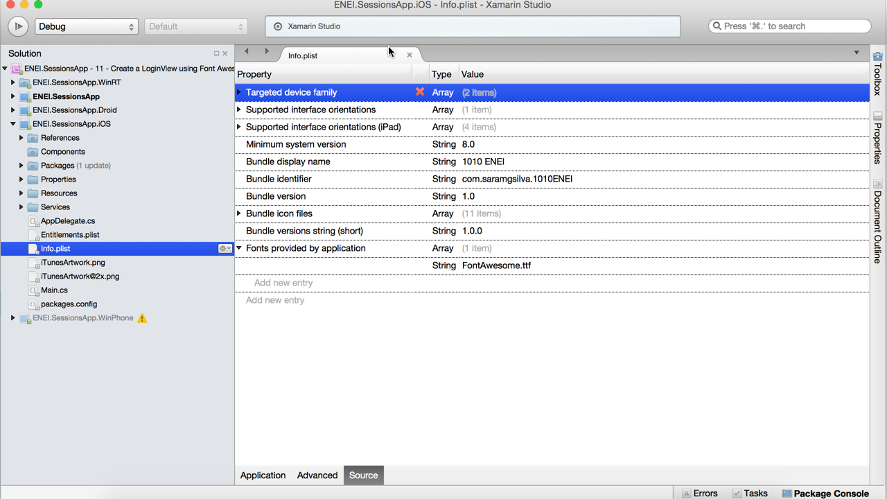
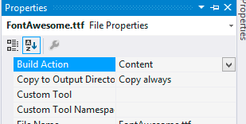

# 1010 ENEI || Xamarin Workshop

<MTMarkdownOptions output='html4'>
	
</MTMarkdownOptions>

> Previous step [**10. Move ItemTemplate to Resources**](10.%20Move%20ItemTemplate%20to%20Resources.md)

### 11. Create a LoginView

In this step you will learn how to create the user interface to the LoginView using the Font Awesome, how to create the LoginViewModel and how to handle the navigation between pages.

#### Creating the UI using Font Awesome

The Font Awesome support icons which can be displayed using a Label, this way is possible to use this font to show icon in the application. In this step you will use the Microsoft, Google and Facebook icons to display in the UI, this way you do not need to use images.

To start, open the **ENEI.SessionsApp** project and add a new XAML page in the **Views** folder, as following:




**Figure 55: Creating LoginView**


The result will be the following XAML page:

    <?xml version="1.0" encoding="utf-8" ?>
    <ContentPage xmlns="http://xamarin.com/schemas/2014/forms"
             xmlns:x="http://schemas.microsoft.com/winfx/2009/xaml"
             x:Class="ENEI.SessionsApp.Views.LoginView">
	<Label Text="{Binding MainText}" VerticalOptions="Center" HorizontalOptions="Center" />
    </ContentPage>

Now, you can define the user interface, but before it you need to do some additional tasks, in each platform to make sure the font will be displayed in the screen when you run the app. 
In general you need:

* In **ENEI.SessionsApp.iOS**

	* Add the **FontAwesome.ttf** file to **Resources** folder

	

		

		**Figure 56: The Resources folder**

		
	* Change the **Info.plist**, to include the font
	
In Visual Studio or Xamarin Studio is possible to edit the xml as following:

     <?xml version="1.0" encoding="UTF-8"?>
     <!DOCTYPE plist PUBLIC "-//Apple//DTD PLIST 1.0//EN" "http://www.apple.com/DTDs/PropertyList-1.0.dtd">
     <plist version="1.0">
       <dict>
	
	   …

	   <key>UIAppFonts</key>
    	<array>
		<string>FontAwesome.ttf</string>
	   </array>	
    </dict>
    </plist>

   
In Xamarin Studio you can add the font as following:

**Figure 57: The Source panel from Info.plist in Xamarin Studio**


* In **ENEI.SessionsApp.Android**

	* Add the **FontAwesome.ttf** to the **Assets** folder

	

		
 
		**Figure 58: The Assets folder**

	

	* Create a **Render** for a **CustomLabel**

	
            [assembly: ExportRenderer(typeof(CustomLabel), typeof(CustomLabelRenderer))]
            namespace ENEI.SessionsApp.Droid.Renders
            {
               public class CustomLabelRenderer: LabelRenderer
               {
                   protected override void OnElementChanged(ElementChangedEventArgs<Label> e)
                  {
            base.OnElementChanged(e);

            var label = (TextView)Control;
            Typeface font = Typeface.CreateFromAsset(Forms.Context.Assets, "FontAwesome.ttf");
            label.Typeface = font;
                  }
               }
            }

	

* In **ENEI.SessionsApp.WinPhone** and **ENEI.SessionsApp.WinRT**


	* Add the **FontAwesome.ttf** to the **Assets/Fonts** folder

 

		

	
		**Figure 59: The Assets/Folder folder**



	*  Set the **FontAwesome.ttf** as **Content** and **Copy Always**

	

		

	
 
		**Figure 60: Configurations**






•	In ENEI.SessionsApp

*	Add a **CustomLabel** class
* 	Define the **FontFamily** for each platform

		public class CustomLabel : Label
    	{
        	public CustomLabel()
        	{
         	  FontFamily = Device.OnPlatform(
               iOS: "FontAwesome", 
               Android: null,
               WinPhone:@"\Assets\Fonts\FontAwesome.ttf#FontAwesome");

            if (Device.OS == TargetPlatform.Windows)
            {
                FontFamily = @"\Assets\Fonts\FontAwesome.ttf#FontAwesome";
            }
		   }
    	}

Now you are ready to create the UI for the LoginView. The base for the page can be something as following:


	<?xml version="1.0" encoding="utf-8" ?>
	<ContentPage xmlns="http://xamarin.com/schemas/2014/forms"
             xmlns:x="http://schemas.microsoft.com/winfx/2009/xaml"
             xmlns:controls="clr-namespace:ENEI.SessionsApp.Controls;assembly=ENEI.SessionsApp"
             x:Class="ENEI.SessionsApp.Views.LoginView"
             Title="Authentication" BackgroundColor="White" x:Name="ContentPage"
             Icon="ic_action_users.png">

             <Grid BackgroundColor="White">
  	         <Grid.RowDefinitions>
               <RowDefinition Height="Auto" />
               <RowDefinition Height="*" />
             </Grid.RowDefinitions>
             <!-- Title - Only for WP-->
            <StackLayout Grid.Row="0" Orientation="Horizontal" Padding="20,10,0,0">
            <StackLayout.IsVisible>
               <OnPlatform Android="false" WinPhone="true" iOS="false"
                    x:TypeArguments="x:Boolean" />
            </StackLayout.IsVisible>
            <Image WidthRequest="48"
                 HeightRequest="38"
                 Source="Images/ic_action_users.png"/>
            <Label FontSize="Medium" FontAttributes="Bold"
               TextColor="Black">
                <OnPlatform Android="" WinPhone="Authentication"
                    iOS="" x:TypeArguments="x:String" />
            </Label>
          </StackLayout>
      <StackLayout Spacing="20" HorizontalOptions="Center" VerticalOptions="CenterAndExpand" Grid.Row="1"> 
               <!—login by social network will be here -->
    </StackLayout>
  </Grid>
</ContentPage>

Then you can define options for login with Facebook, Google or Microsoft as following:

* **Facebook**


        <StackLayout WidthRequest="300" HeightRequest="60" Orientation="Horizontal" BackgroundColor="#3b5998" HorizontalOptions="Center" Spacing="20">
        <controls:CustomLabel FontSize="Small"
                            HorizontalOptions="CenterAndExpand"
                            Text="&#xf09a;"
                            TextColor="White"
                            VerticalOptions="CenterAndExpand" />
        <Label FontAttributes="Bold"
                FontSize="Small"
                HorizontalOptions="StartAndExpand"
                Text="Facebook"
                TextColor="White"
                VerticalOptions="CenterAndExpand" />
        </StackLayout>

        

* **Google**


        <StackLayout WidthRequest="300" HeightRequest="60"  Orientation="Horizontal" BackgroundColor="#dd4b39" HorizontalOptions="Center" Spacing="20">
          <controls:CustomLabel FontSize="Small"
                              HorizontalOptions="CenterAndExpand"
                              Text="&#xf0d4;"
                              TextColor="White"
                              VerticalOptions="CenterAndExpand" />
          <Label FontAttributes="Bold"
                FontSize="Small"
                HorizontalOptions="StartAndExpand"
                Text="Google"
                TextColor="White"
                VerticalOptions="CenterAndExpand" />
        </StackLayout>
 

* **Microsoft**
        

        <StackLayout WidthRequest="300" HeightRequest="60"  Orientation="Horizontal" BackgroundColor="#219dfd" HorizontalOptions="Center" Spacing="20">
        <controls:CustomLabel FontSize="Small"
                           HorizontalOptions="CenterAndExpand"
                           Text="&#xf17a;"
                           TextColor="White"
                           VerticalOptions="CenterAndExpand" />
        <Label FontAttributes="Bold"
               FontSize="Small"
               HorizontalOptions="StartAndExpand"
               Text="Microsoft"
               TextColor="White"
               VerticalOptions="CenterAndExpand" />
        </StackLayout>


When you run the application the result will something as described in figure 61:



**Figure 61: The LoginView**



> See more details about this subject in the following references: [Working with Fonts](http://developer.xamarin.com/guides/cross-platform/xamarin-forms/working-with/fonts/) and [FontAwesome Library for Xamarin.iOS (MonoTouch)](https://github.com/neilkennedy/FontAwesome.Xamarin).


#### Create the LoginViewModel

At this moment, you have the user interface to the LoginView, this way it is possible to define the LoginViewModel, which will have the action to each option in LoginView.

Open the **ENEI.SessionsApp** project and add the **LoginViewModel** to the **ViewModels** folder, as following:


**Figure 62: The LoginViewModel**

Then create the LoginCommnad, as following:

    public class LoginViewModel
    {
        public LoginViewModel()
        {
            LoginCommand =new Command(DoLogin);
        }

        private void DoLogin(object param)
        {
            var option = param.ToString();
            switch (option)
            {
                case "facebook":
                 //connect with facebook api
                    break;
                case "goolge":
                 //connect with google api
                    break;
                case "microsoft":
                 //connect with microsoft api
                    break;
            }
        }

        public ICommand LoginCommand { get; set; }
    }
   

In this case, you only created one ICommand that will be used be all options in the LoginView and for it is required to send as CommandParameter the name of the option, as we will see next.

Now, connect the UI with the LoginViewModel and to start, define the LoginViewModel and binding it to the BindingContext as following:


    public partial class LoginView : ContentPage
    {
        public LoginView()
        {
            InitializeComponent();
            BindingContext = new LoginViewModel();
        }
    }

Then change the StackLayout that is the root for each option as following:

      <StackLayout WidthRequest="300" HeightRequest="60" Orientation="Horizontal" BackgroundColor="#3b5998" HorizontalOptions="Center" Spacing="20">
         <StackLayout.GestureRecognizers>
              <TapGestureRecognizer CommandParameter="facebook"
                                    Command="{Binding LoginCommand}"/>
          </StackLayout.GestureRecognizers>
        <controls:CustomLabel FontSize="Small"
                            HorizontalOptions="CenterAndExpand"
                            Text="&#xf09a;"
                            TextColor="White"
                            VerticalOptions="CenterAndExpand" />
        <Label FontAttributes="Bold"
                FontSize="Small"
                HorizontalOptions="StartAndExpand"
                Text="Facebook"
                TextColor="White"
                VerticalOptions="CenterAndExpand" />
      </StackLayout>

Do a similar implementation to the others option.
When you run the application you should call the **DoLogin** method, as following:


**Figure 63: The DoLogin method in debug mode**


#### Handle Navigation

At this moment you do not have the authentication, but you can create the complete flow to the application. This way, you need to define the navigation between pages, which is the main goal of this step.

To start, you can create a **NavMessage**, as following:


    public class NavMessage
    {
        public string Page { get; set; }

        public object Param { get; set; }
    }

Then, in the App class you can use **MessaginCenter** to navigate between pages, as following:

        public App()
        {
            InitializeComponent();
            MainPage = new NavigationPage(new LoginView())
            {
                BarBackgroundColor = Color.White,
                BarTextColor = Color.Black,
                BackgroundColor = Color.White,
            };

            MessagingCenter.Subscribe<NavMessage>(this, "Navigation", navMessage =>
            {
                switch (navMessage.Page)
                {
                    case "login":
                        MainPage = new LoginView();
                        break;
                    case "sessions":
                        MainPage = new NavigationPage(new SessionsView())
                        {
                            BarBackgroundColor = Color.White,
                            BarTextColor = Color.Black,
                            BackgroundColor = Color.White,
                        };
                        break;
                    case "details":
                        MainPage.Navigation.PushAsync(new SessionDetailsView(navMessage.Param as Session), true);
                        break;
                }
            });
        }

> There are different way to handle the navigation and it can be defined based in the application requirements.

In the **LoginViewModel** you should change the **DoLogin** method to:

        private void DoLogin(object param)
        {
            var option = param.ToString();
            switch (option)
            {
                case "facebook":
                 //connect with facebook api
                    break;
                case "goolge":
                 //connect with google api
                    break;
                case "microsoft":
                 //connect with microsoft api
                    break;
            }
            MessagingCenter.Send(new NavMessage{ Page = "sessions"}, "Navigation");
        }

        

> At this moment is not important the authentication, because that feature will be focused in nexts steps.


In the **SessionsViewModel** change the **SeeSessionDetails** method to:

      

       private void SeeSessionDetails(object param)
        {
            var session = param as Session;
            if (session != null)
            {
                MessagingCenter.Send(new NavMessage
                {
                    Page = "details",
                    Param = session
                }, "Navigation");
            }
        }
And, in the **SessionsView** remove the navigation, which result should be:

      public SessionsView()
      {
         InitializeComponent();
      }
   

At this moment if you run the application you should start in the LoginView and then you can see the SessionsView and the SessionDetailsView.

> Next step [**Wrapping Up**](Wrapping Up.md)
