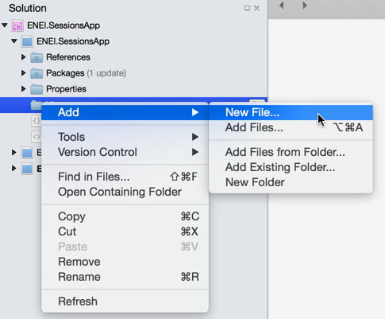

# 1010 ENEI || SessionsApp

<MTMarkdownOptions output='html4'>
    
</MTMarkdownOptions>

> Previous step [**Guide 1: Creating a Xamarin Forms project**](1. Creating a Xamarin Forms project.md)

## Guide 2. Creating the model and the data source

#### The model

Before creating the UI, you need to define the model, for it you will define:

* **Session:** the class that defines a session from 1010 ENEI event
* **Speaker:** the class that defines a speaker

Each session should have a speaker (In real scenarios it can have more than one!). Figure 22 defines the class diagram from the model:

**Figure 22: The model**

In ENEI.SessionsApp project create the Session and the Speaker classes in a “Model” folder, as described in figures 23 and 24:

**Figure 23: Creating new Folder**

**Figure 24: Adding new file**

The Session class can be defined by:

    public class Session : INotifyPropertyChanged
    {
        private int _numLikes;
        private Speaker _speaker;
        private string _date;
        private string _description;
        private string _name;
        private bool _isFavorite;
        private string _schedule;
        private string _room;

        public string Name
        {
            get { return _name; }
            set { _name = value; OnPropertyChanged(); }
        }

        public string Description
        {
            get { return _description; }
            set { _description = value; OnPropertyChanged(); }
        }

        public string Date
        {
            get { return _date; }
            set { _date = value; OnPropertyChanged(); }
        }

        public int NumLikes
        {
            get { return _numLikes; }
            set { _numLikes = value; OnPropertyChanged();}
        }

        public Speaker Speaker
        {
            get { return _speaker; }
            set { _speaker = value; OnPropertyChanged(); }
        }

        public bool IsFavorite
        {
            get { return _isFavorite; }
            set { _isFavorite = value; OnPropertyChanged();}
        }

        public string Schedule
        {
            get { return _schedule; }
            set { _schedule = value; OnPropertyChanged(); }
        }

        public string Room
        {
            get { return _room; }
            set { _room = value; OnPropertyChanged(); }
        }

        public string Details
        {
            get { return string.Format("{0} | {1} | Sala {2} ", Date, Schedule, Room); }
        }

        public event PropertyChangedEventHandler PropertyChanged;
        
        protected virtual void OnPropertyChanged([CallerMemberName] string propertyName = null)
        {
            var handler = PropertyChanged;
            if (handler != null) handler(this, new PropertyChangedEventArgs(propertyName));
        }
    }

And the Speaker class can be defined by:
         

    public class Speaker : INotifyPropertyChanged
    {
        private string _name;
        private string _imageUrl;

        public string Name
        {
            get { return _name; }
            set { _name = value; OnPropertyChanged();}
        }

        public string ImageUrl
        {
            get { return _imageUrl; }
            set { _imageUrl = value; OnPropertyChanged(); }
        }

        public event PropertyChangedEventHandler PropertyChanged;

        protected virtual void OnPropertyChanged([CallerMemberName] string propertyName = null)
        {
            var handler = PropertyChanged;
            if (handler != null) handler(this, new PropertyChangedEventArgs(propertyName));
        }
    }

> Both classes implements the interface **INotifyPropertyChangedv**, which allow notify the UI about changes in model and this way the data will be updated in the UI (when is used the bindings).

#### The data source

The data source will define the data that will be loaded by the application, at this moment you will have hard code data, but in real scenarios you should have a file, database or services to provide it.

Get the **SessionsDataSource class** [here](https://github.com/saramgsilva/XamarinWorkshop/blob/master/1010ENEI/2.%20Create%20the%20model%20and%20data%20source/ENEI.SessionsApp/ENEI.SessionsApp/Data/SessionsDataSource.cs), or create your own data.

> Next step [**Guide 3: Creating the SessionsView**](3. Creating the SessionsView.md)
