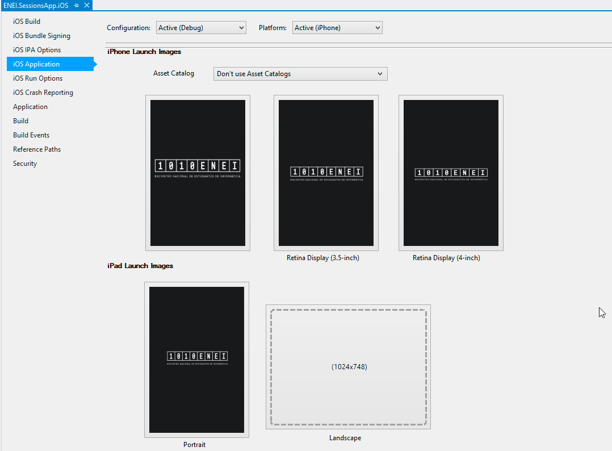
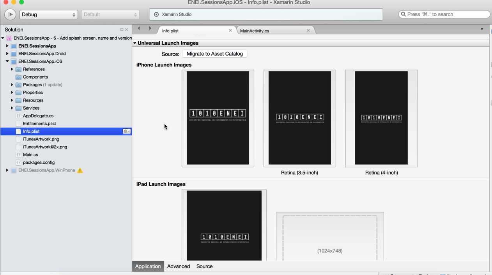
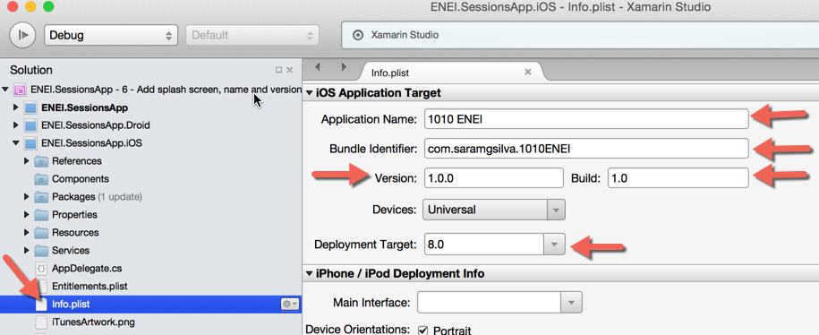
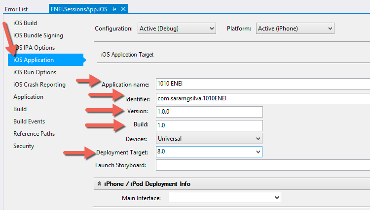
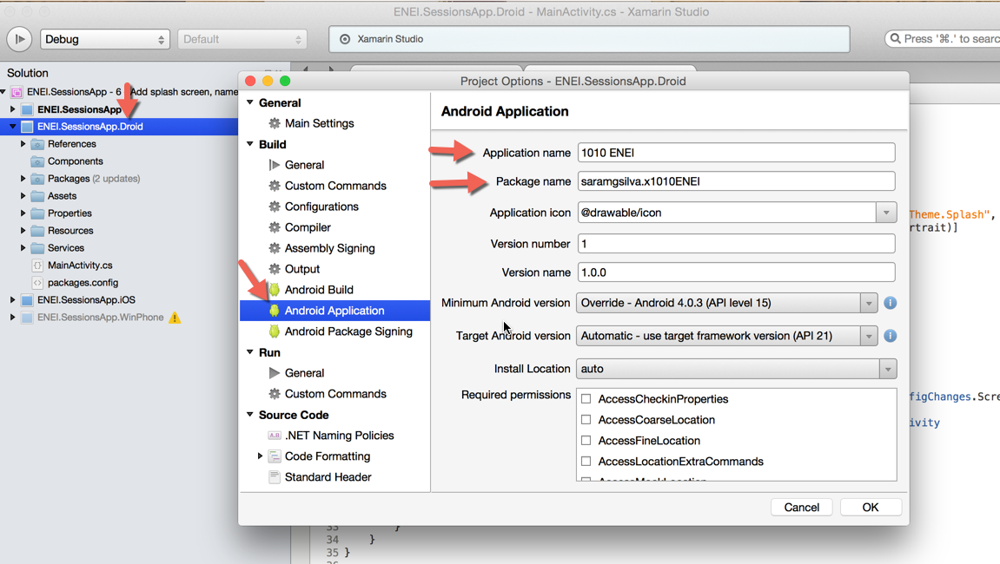
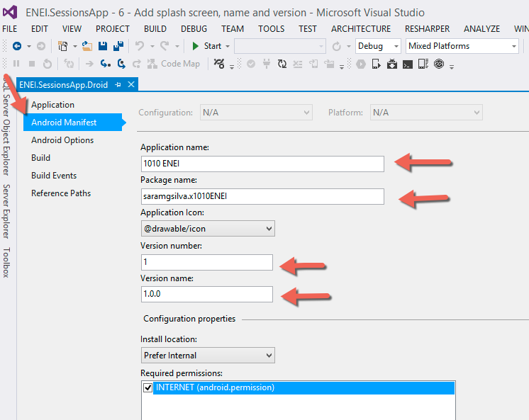
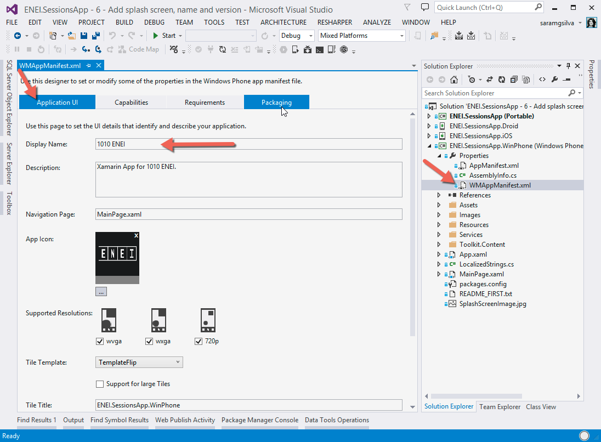
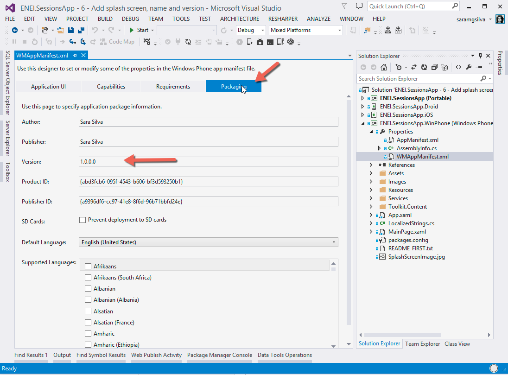

# 1010 ENEI || SessionsApp

<MTMarkdownOptions output='html4'>
	
</MTMarkdownOptions>

> Previous step [**Guide 5: Add ShareService**](5. Add ShareService.md)

### Guide 6. Add splash screen, name and version

* [Define the splash screen](#define-the-splash-screen)
* [Define the name and the version for each platform](#define-the-name-and-the-version-for-each-platform)

In this step you will learn how to create the splash screen to all platforms and you learn to define the name & version of the application.

#### Define the splash screen

The splash screen in mobile application is the first screen that the user will see, in some applications it is used to load initial data. It is defined in different ways to each platform and for each one you will learn how it works:

* In **ENEI.SessionsApps.iOS**

In iOS and iPad applications is possible to define launch images as splash screen in the Info.plist. It is described in the following figures:

**Figure 6.1: Defining Launch Images using Visual Studio**

**Figure 6-2: Defining Launch images in Xamarin Studio**

•	In **ENEI.SessionsApps.Android**

By default, in Android applications, there is not splash screen concept. To solve it, is possible to create an Activity that will be a splash screen page.

In the **ENEI.SessionsApp** create the **SplashScreen** class, as following:

    [Activity(Label = "1010 ENEI", MainLauncher = true, NoHistory = true, Theme = "@style/Theme.Splash",
     ConfigurationChanges = ConfigChanges.ScreenSize, ScreenOrientation = ScreenOrientation.Portrait)]
    public class SplashScreen : Activity
    {
        protected override void OnCreate(Bundle bundle)
        {
            base.OnCreate(bundle);

            var intent = new Intent(this, typeof(MainActivity));
            StartActivity(intent);
            Finish();
        }
    }

In the **Resources\Values** folder create an xml file called **Style**, as following:
  

     <?xml version="1.0" encoding="utf-8" ?>
       <resources>
            
           
    </resources>

Then change the **MainActivity** to:

    [Activity(Label = "1010 ENEI", Theme = "@style/Theme.ENEI", ConfigurationChanges = ConfigChanges.ScreenSize | ConfigChanges.Orientation)]
  
    public class MainActivity : global::Xamarin.Forms.Platform.Android.FormsApplicationActivity
    {
        protected override void OnCreate(Bundle bundle)
        {
            base.OnCreate(bundle);
            global::Xamarin.Forms.Forms.Init(this, bundle);
            ActionBar.SetIcon(Resource.Drawable.ic_action_users);
            LoadApplication(new App());
        }
    }
 
If you run the Android application you will get the “splash screen” defined, similar to the others platforms.

 > See more about it in this article [Creating a Splash Screen](http://developer.xamarin.com/guides/android/user_interface/creating_a_splash_screen/).

* In **ENEI.SessionsApps.WinPhone**

Windows Phone application supports splash screen by default, this way it only required a nice image which will be showed to the user.

**Figure 6-3: The SplashScreenImage**

#### Define the name and the version for each platform

To define the name & the version for each platform you will need:

* In **ENEI.SessionsApps.iOS**

Open the **Info.plist** or the **project’s properties** as described in figure 6-4 and figure 6-5:

**Figure 6-4: Defining Name & Version using Xamarin Studio (Info.plist)**

**Figure 6-5: Defining Name & Version using Visual Studio (project’s properties)**

* In **ENEI.SessionsApp.Android**

Open the project’s properties as described in figure 6-6 and figure 6-7:

**Figure 6-6: Defining Name & Version using Xamarin Studio (project’s properties)**

**Figure 6-7: Defining Name & Version using Visual Studio (project’s properties)**

* In **ENEI.SessionsApps.WinPhone**

Open the manifest file as describe in the figure 6-8 and figure 6-9:

**Figure 6-8: Defining Name in the manifest file**

**Figure 6-9: Defining Version in the manifest file**

> Next step [**Guide 7: Add support for WinRT Apps**](7. Add support for WinRT Apps.md)
