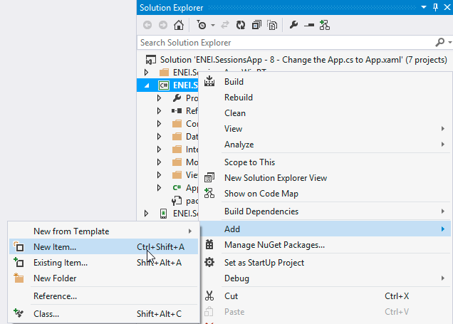

# 1010 ENEI || Xamarin Workshop

<MTMarkdownOptions output='html4'>
	
</MTMarkdownOptions>

> Previous step [**Guide 7: Adding support for WinRT Apps**](7.%20Adding%20support%20for%20WinRT%20Apps.md)

### 8. Changing the App.cs to App.xaml

In this step you will learn how to change the **App.cs** to have the **App.xaml** file, which will define the Xamarin Forms application.

In the **ENEI.SessionsApp** project it is possible to find the App.cs file which defines the application. It is a simple class defined in a *.cs file, which can be defined using a XAML approach. For it you need to create a new XAML page as described in figure 51 and figure 52:

**Figure 51: Adding a new item (using Visual Studio)**

**Figure 52: Adding a new Forms Xaml Page called App (using Visual Studio)**

The result will be something as following:


**App.xaml**

	    <?xml version="1.0" encoding="utf-8" ?>
        <ContentPage xmlns="http://xamarin.com/schemas/2014/forms"
             xmlns:x="http://schemas.microsoft.com/winfx/2009/xaml"
             x:Class="ENEI.SessionsApp.App">
	       <Label Text="{Binding MainText}" VerticalOptions="Center" HorizontalOptions="Center" />
       </ContentPage>

**App.xaml.cs**

     public partial class App : ContentPage
     {
        public App()
        {
            InitializeComponent();
        }
     }

At this moment, this is a content page, which is not our goal, but it is the workaround to create the App.xaml and App.xaml.cs files. Now, to create the Xamarin Forms application based in the XAML approach we need to change the code above, as following:

**App.xaml**

 
      <?xml version="1.0" encoding="utf-8" ?>
      <Application xmlns="http://xamarin.com/schemas/2014/forms"
             xmlns:x="http://schemas.microsoft.com/winfx/2009/xaml"
             x:Class="ENEI.SessionsApp.App">
      </Application>	

 
**App.xaml.cs**


    public partial class App : Application
    {
        public App()
        {
            InitializeComponent();
        }
    }

 
With this, you will have an App class that inherits from Xamarin.Forms.Application, to avoid it, you should delete the App.cs file, but before we need to move the code from the App.cs to the App.xaml.cs, which the result will be something as following: 
 
    public class App : Application
    {
        public App()
        {
            // The root page of your application
            MainPage = new NavigationPage(new SessionsView())
            {  
                BarBackgroundColor = Color.White,
                BarTextColor = Color.Black,
                BackgroundColor = Color.White,
            };
        }

        protected override void OnStart()
        {
            // Handle when your app starts
        }

        protected override void OnSleep()
        {
            // Handle when your app sleeps
        }

        protected override void OnResume()
        {
            // Handle when your app resumes
        }
    }


If you run the application it must behave as before.

> Next step [**9. Using MVVM pattern**](9. Using MVVM pattern.md)
