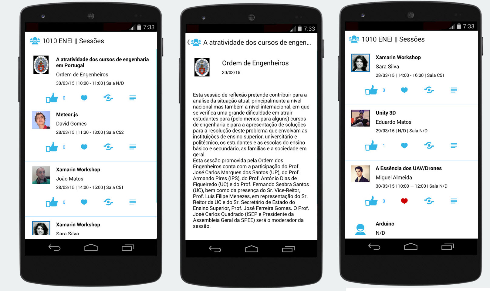

# 1010 ENEI || SessionsApp


<MTMarkdownOptions output='html4'>

  

</MTMarkdownOptions>


## Wrapping Up


Xamarin Forms allow us to quickly create native applications for the different platforms with the same code base. This way, it will reduce the maintenance time and increases the time to improve the application.



**Figure X: The Android application**



**Figure Y: The iOS application**



**Figure Z: The Windows Phone application**



**Figure T: The 1010 ENEI Sessions App**